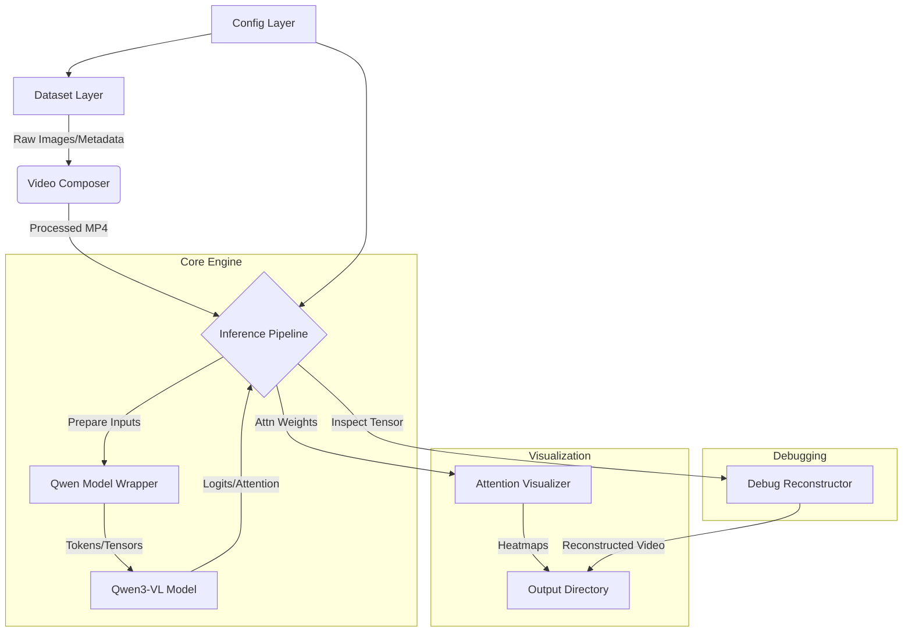

# DriveCritic-VL 项目概览

DriveCritic-VL 是一个专为自动驾驶场景分析设计的视觉-语言模型（VLM）框架。它基于 **Qwen3-VL** 架构，能够理解多视角的驾驶视频数据，并提供驾驶行为分析、场景描述以及对自我车辆（Ego-Car）的决策评价。

## 🚀 核心架构与设计 (Architecture & Design)

本项目采用模块化分层设计，主要分为数据层、核心层、工具层和配置层。

### 1. 系统架构图 (System Architecture)



### 2. 核心工作流 (Workflow)

1.  **初始化阶段**：
    *   `main.py` 读取 `configs/inference.yaml`。
    *   `DatasetFactory` 根据配置加载指定数据集（NuScenes, DriveLM, LingoQA）。
    *   `InferencePipeline` 初始化模型 wrapper、composer 和 visualizer。

2.  **数据处理阶段**：
    *   **懒加载 (Lazy Loading)**：Pipeline 检查是否已有视频缓存。
    *   **实时合成 (On-the-fly Composition)**：如果没有缓存，`VideoComposer` 将多视角/时序图片拼接成 MP4 视频。
    *   **预处理**：`QwenModelWrapper` 将视频和文本 Prompt 转换为模型所需的 Tensor (Input IDs, Pixel Values)。

3.  **推理与调试阶段**：
    *   **输入维测 (`_inspect_inputs`)**：Pipeline 会将送入模型的 Pixel Values 逆向还原为视频 (`model_seen_input.mp4`)，用于验证预处理是否正确（检查归一化、Patch布局）。
    *   **模型前向**：Qwen3-VL 执行推理，生成文本。
    *   **输出维测 (`_inspect_outputs`)**：分析 Logits 和 Attention 层的形状。

4.  **后处理阶段**：
    *   **可视化**：如果开启，`AttentionVisualizer` 提取 Attention Map 并叠加在原始视频帧上。
    *   **结果保存**：生成的文本和可视化结果存入 `outputs/`。

### 3. 类图设计 (Class Structure)

*   **`InferencePipeline` (src/core/pipeline.py)**
    *   **职责**：总控类，协调数据流。
    *   **关键方法**：
        *   `run_sample()`: 执行单样本全流程。
        *   `_inspect_inputs()`: **[New]** 深度解析输入 Tensor，逆向还原视频以排查花屏/噪声问题。
        *   `_reconstruct_video_tensor()`: **[New]** 处理 (Tp, C, Ph, Pw) 复杂布局的 Tensor 还原。
*   **`QwenModelWrapper` (src/core/model_wrapper.py)**
    *   **职责**：封装 HuggingFace Transformer 接口。
    *   **关键方法**：
        *   `prepare_inputs()`: 处理 Chat Template 和 Vision Info。
        *   `forward_for_viz()`: 开启 `output_attentions=True` 的前向传播。
*   **`BaseDataset` & Subclasses (src/data/datasets.py)**
    *   **职责**：标准化数据接口。
    *   **子类**：`NuScenesDataset`, `DriveLMDataset`, `LingoQADataset`。
    *   **数据结构**：统一封装为 `DataSample` (包含 ID, 图片路径列表, 视频路径, QA对)。

---

## 🚀 快速开始 (Quick Start)

### 1. 推理功能 (Inference)

#### A. 流水线模式 (main.py) [推荐]
基于 `configs/inference.yaml` 配置文件的完整流水线。

*   **单样本调试 (Single Mode)：**
    ```bash
    python main.py --config configs/inference.yaml --mode single --id scene-0061
    ```
    *此时系统会自动触发 `InferencePipeline._inspect_inputs`，在 `outputs/debug_inspect/` 下生成调试视频。*

*   **全量数据集评测 (Dataset Mode)：**
    ```bash
    python main.py --config configs/inference.yaml --mode dataset
    ```

#### B. 基础脚本模式 (infer_base.py)
适合无需复杂配置的单视频快速测试。
```bash
python infer_base.py single --input_path assets/demo.mp4 --prompt_file prompt_demo.txt
```

### 2. 模块使用指南 (Module Guide)

#### 📦 数据加载与准备
*   **生成视频缓存：**
    ```bash
    python src/tools/prepare_videos.py --config configs/datasets.yaml --dataset_key nuscenes --fps 2
    ```
*   **检查数据集完整性：**
    ```bash
    python src/tools/check_datasets.py
    ```

#### 🧠 注意力可视化
想要查看模型关注画面的哪些区域：
1.  修改 `configs/inference.yaml`：
    ```yaml
    visualization:
      enabled: true
      keywords: ["pedestrian", "car"] # 关注的关键词
    ```
2.  运行 `main.py`，结果将保存在 `outputs/heatmaps/`。

---

## 🛠 功能扩展指南 (Extension Guide)

### 1. 添加新数据集
1.  在 `src/data/datasets.py` 中继承 `BaseDataset`。
2.  实现 `_load_data`，将原始数据转换为 `DataSample` 列表。
3.  在 `src/data/factory.py` 注册新类。

### 2. 添加新视频合成布局
1.  在 `src/utils/video_composer/` 中继承 `BaseComposer`。
2.  实现 `compose_layout` (例如：实现 3x2 Grid 或 环视+BEV 布局)。
3.  在 `src/utils/video_composer/__init__.py` 注册。

## 📝 开发与调试规范
*   **Tensor 检查**：如果你发现模型输出胡言乱语，首先检查 `outputs/debug_inspect/<task_id>/model_seen_input.mp4`。如果这个视频是花屏或全黑，说明预处理（归一化/尺寸）有问题，而不是模型本身的问题。
*   **配置优先**：尽量通过 `configs/` 调整参数（如 FPS、Resolution），避免硬编码。
