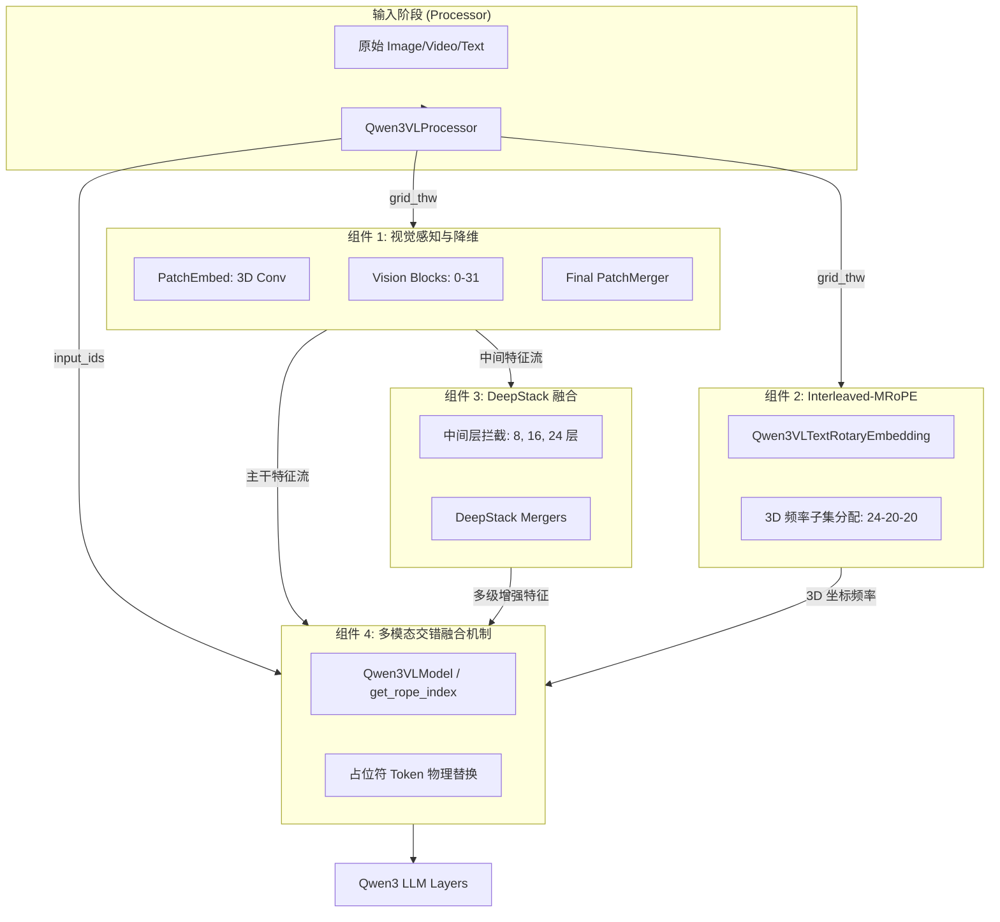
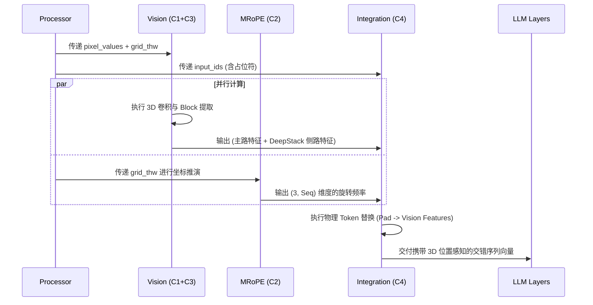
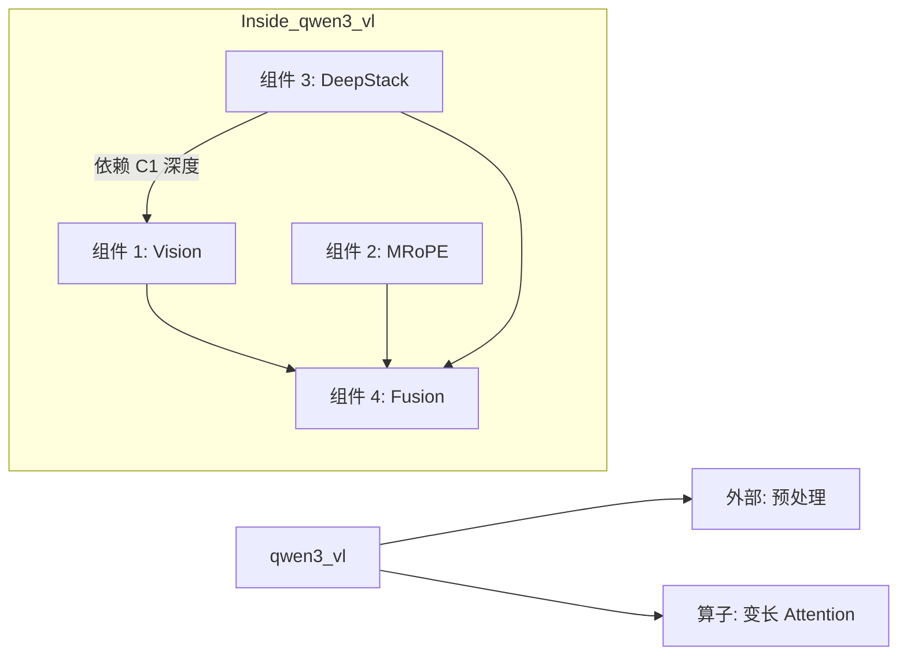

# AI 系统：Qwen3-VL 核心模型总览 (qwen3_vl)

## 1. 模块简介

`qwen3_vl` 模块是 Qwen3-VL 项目的物理模型定义核心，承载了视觉感知塔（Vision Tower）与语言解码器（Language Decoder）的物理碰撞与深度融合。该模块不仅是一个简单的神经网络堆叠，它通过首创的 **DeepStack** 架构实现了对极细微视觉特征的捕获，并利用 **Interleaved-MRoPE** 机制在 1M Token 的超长上下文内建立了稳健的 3D 时空坐标系。

### 核心价值
- **模态咬合枢纽**：负责将 `qwen-vl-utils` 预处理后的离散张量转化为统一的隐藏层表征。
- **动态坐标调度**：确保每一组视觉特征像素都能精准匹配其在 3D 旋转位置空间中的频率分量。
- **端到端推理基石**：支持从边缘侧（2B/4B）到云端（32B/72B）的 Dense 与 MoE 架构的高效推理。

## 2. 模块内组件拓扑架构图

该图展示了四大组件如何通过 `image_grid_thw` 这一灵魂变量实现数据与逻辑的完美咬合。



## 3. 核心特性与组件映射表

| 核心特性 | 技术实现路径 | 涉及组件 |
| :--- | :--- | :--- |
| **原生 1M 长视频支持** | YaRN + 3D 交错频率分配 | 组件 2, 组件 4 |
| **细粒度 OCR/Grounding** | 多级中间层特征拦截与独立降维 | 组件 3, 组件 1 |
| **统一时空建模** | 3D 卷积补丁嵌入 (Conv3d) | 组件 1 |
| **极速推理降采样** | 2x2 空间特征合并 (Spatial Unfold) | 组件 1 |
| **复杂多模态混排** | 动态 `rope_deltas` 补偿机制 | 组件 4 |

## 4. 文件结构与职责说明 [📄](file://README.md)

| 文件名 | 核心职责 | 对应组件 |
| :--- | :--- | :--- |
| `modeling_qwen3_vl.py` | 物理网络定义。包含 VisionBlock, DecoderLayer 及融合逻辑。 | 组件 1, 2, 3, 4 |
| `processing_qwen3_vl.py` | 协议转换。将原始数据转换为模型所需的交错格式。 | 组件 4 (前置) |
| `configuration_qwen3_vl.py` | 参数中枢。管理 DeepStack 索引及 MRoPE 配比。 | 全局统筹 |

## 5. 组件协同全链路流程图



## 6. 公开接口详解 (顶层总控)

### `Qwen3VLForConditionalGeneration` [📄](file://qwen3_vl/modeling_qwen3_vl.py#L1322)
这是整个模块对外暴露的单点入口。

- **`from_pretrained(path)`**: 自动加载 `vision_config` 和 `text_config`。
- **`forward(...)`**: 
    - **输入**: `input_ids`, `pixel_values`, `image_grid_thw` 等。
    - **逻辑**: 调用 `Qwen3VLModel` 执行组件协同逻辑。
    - **返回**: 包含生成 logits 和多级特征输出的 `Qwen3VLCausalLMOutputWithPast`。

### `Qwen3VLProcessor` [📄](file://qwen3_vl/processing_qwen3_vl.py#L40)
- **`__call__(...)`**: 核心预处理函数。它调用 `qwen-vl-utils` 获得图像尺寸，并在文本序列中精准挖掘“空洞”，插入正确数量的 `<|image_pad|>`。

## 7. 组件间统一数据结构：`grid_thw`

这是一个形状为 `(N, 3)` 的张量，其中 $N$ 是图像/视频数量，`[T, H, W]` 是分块后的网格坐标。
- **对组件 1 的意义**：决定了 `Conv3d` 的滑窗步数及 `PatchMerger` 的折叠边界。
- **对组件 2 的意义**：决定了 3D 旋转位置编码在 H 和 W 维度的坐标上限。
- **对组件 4 的意义**：用于计算视觉块占据的物理长度，从而维持序列顺序。

## 8. 快速开始 (基于组件协作)

```python
from qwen3_vl.modeling_qwen3_vl import Qwen3VLForConditionalGeneration
from qwen3_vl.processing_qwen3_vl import Qwen3VLProcessor

# 组件协同初始化
model = Qwen3VLForConditionalGeneration.from_pretrained("Qwen/Qwen3-VL-2B-Instruct")
processor = Qwen3VLProcessor.from_pretrained("Qwen/Qwen3-VL-2B-Instruct")

# 构造多模态输入（涉及组件 4 的数据格式转换）
messages = [{"role": "user", "content": [{"type": "image", "image": "demo.png"}, {"type": "text", "text": "图中内容？"}]}]
inputs = processor(text=processor.apply_chat_template(messages, tokenize=False), images=img, return_tensors="pt")

# 全链路前向传播（涉及组件 1, 2, 3 的咬合）
outputs = model(**inputs)
```

## 9. 典型场景：DeepStack 特征提取用例

在需要精细化 OCR 或空间检测时，可以手动拦截 DeepStack 输出：
```python
# 在 forward 之后，组件 3 会返回 3 个层级的特征
deepstack_feats = outputs.deepstack_features 
# 分别对应配置中 deepstack_visual_indexes=[8, 16, 24] 的降维输出
print(f"Level 8 Feature Shape: {deepstack_feats[0].shape}") 
```

## 10. 最佳实践 (Best Practices)

- **显存咬合优化**：使用 `auto` 映射 device 时，尽量让 Vision Tower（组件 1, 3）驻留在第一张卡，因为其产生的中间特征张量规模巨大。
- **坐标对齐策略**：在多图对话中，务必开启 `add_vision_id=True`，这能协助组件 2 的 1D 位置索引进行非重叠递增，减少幻觉。

## 11. 设计决策：为什么选择“交错式”物理替换？

在早期的多模态设计中（如 Flamingo），多模态融合通常通过 Cross-Attention 完成。
Qwen3-VL 选择在 `qwen3_vl` 模块中使用“物理 Token 替换”：
- **优点**：极大地简化了模型对变长多图的处理。视觉信息直接作为序列的一部分参与自注意力计算。
- **代价**：对组件 2 (MRoPE) 提出了极高要求，必须通过复杂的坐标偏移（组件 4）来保证文本和图像位置的和谐。

## 12. 内部实现原理：特征-位置同步 (Sync)

这是 Qwen3-VL 最硬核的底层逻辑：
- 当组件 1 将 $2 	imes 2$ 个像素补丁合并为一个 Token 时，组件 2 必须同步感知到这一空间折叠。
- **同步机制**：组件 2 在计算 RoPE 频率时，会对 `grid_thw` 进行对应的 `// spatial_merge_size` 操作。这确保了经过降采样后的视觉向量，依然能匹配到其原始空间位置的平均中心坐标。

## 13. 跨组件错误处理与调试

| 错误信息 | 原因分析 | 协作组件排查 |
| :--- | :--- | :--- |
| `RuntimeError: The size of tensor...` | 视觉特征数量与 Pad Token 数量不符。 | 排查组件 4 的 `input_ids` 生成逻辑。 |
| `ValueError: Index out of range` | DeepStack 索引越界。 | 排查组件 3 的配置与组件 1 的 Block 深度。 |
| **坐标幻觉** | 图像内容与位置描述对不上。 | 排查组件 2 的 `mrope_section` 划分是否正确。 |

## 14. 模块依赖关系图 (Component Dependency Graph)



## 15. 相关文档链接

- [组件 1 详解：视觉感知与降维](./组件_视觉塔基础.md)
- [组件 2 详解：多维位置编码 MRoPE](./组件_多维位置编码.md)
- [组件 3 详解：视觉多级特征融合](./组件_视觉多级融合.md)
- [组件 4 详解：多模态交错融合机制](./组件_融合机制.md)

## 16. 架构演进与变更历史

- **v2.0 -> v3.0**: 移除了固定的绝对 2D 位置编码，引入了基于 `grid_thw` 的动态插值编码，使得模型理论上支持无限宽高比的输入。
- **v2.5 -> v3.0**: Interleaved-MRoPE 正式取代了 T-RoPE，实现了对长视频更精细的秒级切片对齐。

---
*由 [Mini-Wiki v3.0.6](https://github.com/trsoliu/mini-wiki) 自动生成 | 2026-03-01*
