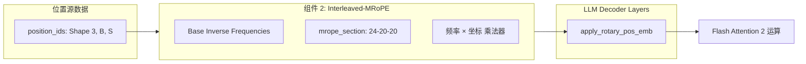
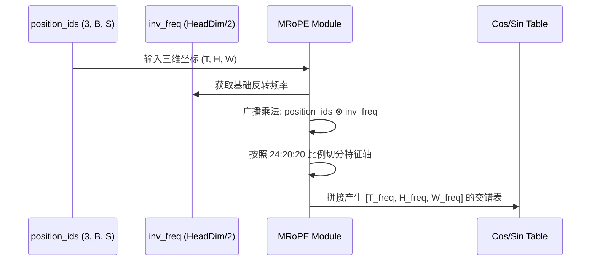
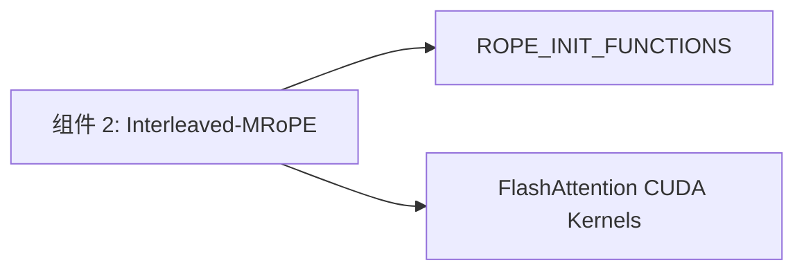

# 组件深度解析：多维旋转位置编码 (Interleaved-MRoPE)

## 1. 组件概述

在处理多模态交错输入（如文本中穿插图片或视频）时，传统的 1D 旋转位置编码（RoPE）无法有效表达视觉 Token 的 3D 时空结构（帧 $T$、高度 $H$、宽度 $W$）。Qwen3-VL 引入了革命性的 **Interleaved-MRoPE**（交错式多模态旋转位置嵌入）。

该组件通过 `Qwen3VLTextRotaryEmbedding` 实现，其核心思想是：将 Attention Head 的隐藏维度划分为三个频率子集，分别用于编码时间、高度和宽度。这种设计使得语言模型能够像人类大脑一样，在处理文字流的同时，同步在内部构建起精确的视觉 3D 坐标系。

### 核心价值
- **3D 坐标原生支持**：文本 Token 与视觉 Patch 在同一个多维坐标空间内共存。
- **百万级长度外推**：配合 YaRN 机制，使得模型能完美理解长达数小时的长视频。

## 2. 架构位置图



## 3. 核心特性表格

| 特性 | 技术实现 | 关联接口 |
| :--- | :--- | :--- |
| **维度交错分配** | `mrope_section = [24, 20, 20]` 分配策略。 | `Qwen3VLTextRotaryEmbedding.__init__` |
| **YaRN 外推支持** | 动态 `factor` 缩放，适配 1M 上下文。 | `ROPE_INIT_FUNCTIONS['yarn']` |
| **3D 坐标注入** | 通过 `(3, B, S)` 维度的 position_ids 注入。 | `apply_rotary_pos_emb` |

## 4. 文件与职责说明 [📄](file://qwen3_vl/modeling_qwen3_vl.py#L291)

- **`modeling_qwen3_vl.py`**:
    - `Qwen3VLTextRotaryEmbedding`: 核心类，负责生成 3D 交错的正余弦查找表。
    - `apply_rotary_pos_emb`: 核心算子，将位置信息旋转注入 Q/K 向量。

## 5. 核心算法流程：3D 频率计算



## 6. 公开接口详解

### `Qwen3VLTextRotaryEmbedding.forward` [📄](file://qwen3_vl/modeling_qwen3_vl.py#L344)
生成适配 Qwen3-VL 架构的 3D 旋转嵌入。

- **输入参数**: `x` (参考张量), `position_ids` (3, B, S)。
- **核心逻辑**: 如果 `position_ids` 是 2D 的（纯文本），会自动扩展为 3D 以复用计算逻辑。
- **使用示例**:
```python
# 初始化 RoPE (假设 head_dim=128)
rope = Qwen3VLTextRotaryEmbedding(config)
# 构造包含 1D, H, W 信息的位置 ID
pos_ids = torch.stack([t_ids, h_ids, w_ids], dim=0) 
# 生成 cos, sin
cos, sin = rope(hidden_states, pos_ids)
```

## 7. 类型定义：频率分配矩阵 (mrope_section)

| 物理维度 | 频率槽位 (Sections) | 特征数 (dims) | 语义角色 |
| :--- | :--- | :--- | :--- |
| **Temporal** | 24 | 48 | 视频帧顺序 / 文本绝对位置。 |
| **Height** | 20 | 40 | 视觉网格的垂直坐标索引。 |
| **Width** | 20 | 40 | 视觉网格的水平坐标索引。 |

## 8. 快速开始 (YaRN 开启)

在 `config.json` 中配置：
```json
"rope_parameters": {
    "rope_type": "yarn",
    "factor": 3.0,
    "mrope_section": [24, 20, 20]
}
```

## 9. 常见用例：理解视觉 Token 的坐标 ID

假设一个视觉 Token 位于视频的第 10 帧，高度网格坐标 5，宽度网格坐标 8：
- **`position_ids[0]` (T)**: `[10]` (对应文本序列进度)。
- **`position_ids[1]` (H)**: `[5]` (对应 Y 轴)。
- **`position_ids[2]` (W)**: `[8]` (对应 X 轴)。
这种分配确保了模型能感知到 Token 间的欧几里得距离。

## 10. 最佳实践

- **外推因子选择**：处理 1M 文本时，由于视觉部分坐标增长慢，设置 `factor=3.0` 效果通常优于 `factor=4.0`（过强的缩放会稀释文本注意力）。
- **精度对齐**：务必在 `fp32` 模式下计算旋转角度，再转回 `bf16`，以避免长序列累积舍入误差。

## 11. 设计决策：为何交错分配维度？

Qwen3-VL 放弃了“求和”或“全维度计算”坐标的方式，选择了维度划分：
- **收益**：避免了不同维度位置信息的相互干扰（如时间坐标过大冲淡了宽度坐标的变化）。
- **科学性**：各维度拥有独立的频率响应区间，使得 Attention 算子能自动通过特征轴识别这是来自哪个维度的位置偏移。

## 12. 内部实现原理：旋转注入算子 [📄](file://qwen3_vl/modeling_qwen3_vl.py#L402)

```python
def rotate_half(x):
    # 将向量对半拆分并取负交换 [x1, x2] -> [-x2, x1]
    ...

def apply_rotary_pos_emb(q, k, cos, sin):
    # 数学本质: (q * cos) + (rotate_half(q) * sin)
    # 这等效于复数空间内的向量旋转
    ...
```

## 13. 错误处理

- **RuntimeError: mrope_section sum != head_dim**：配置文件中的 section 总和必须等于注意力头的一半。
- **坐标爆炸 (NaN)**：通常是 position_ids 过大导致的。请检查 `grid_thw` 是否被错误设置为负数。

## 14. 依赖关系图



## 15. 相关文档链接

- [模块总览：AI 系统核心模型总览](./qwen3_vl_module_overview.md)
- [组件 4：多模态交错融合机制](./组件_融合机制.md)

## 16. 变更历史

- **v3.0**: 移除了 Qwen2-VL 的 `mrope_position_deltas` 在 RoPE 层内部的直接硬编码，改为在 Model 层动态注入。
- **v3.0**: 引入交错分配频率 (Interleaved) 技术。

---
*由 [Mini-Wiki v3.0.6](https://github.com/trsoliu/mini-wiki) 自动生成 | 2026-03-01*
