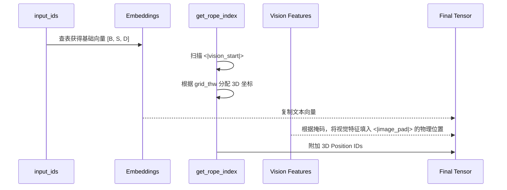
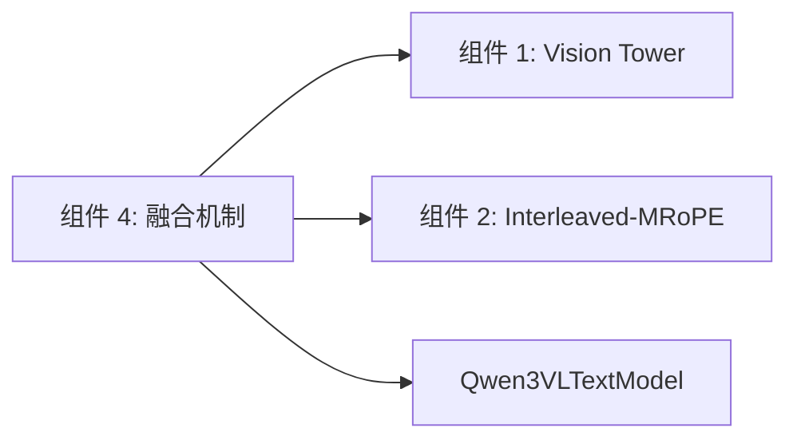

# 组件深度解析：多模态交错融合机制 (Multimodal Integration)

## 1. 组件概述

Qwen3-VL 的核心竞争力之一在于其对**交错（Interleaved）多模态输入**的极致支持。不同于早期的“先图像后文本”的固定模式，Qwen3-VL 允许图像和视频作为特殊的“视觉原子”，在文本序列的任意位置出现。

多模态交错融合组件由 `Qwen3VLModel` 实现。其核心职责是在前向传播的极早期阶段，利用 `get_rope_index` 函数动态生成适配当前混排序列的 3D 旋转位置索引，并通过“掩码替换”逻辑，将文本词嵌入（Text Embeddings）中的占位符 Token 物理替换为视觉塔提取的 DeepStack 稠密特征向量。

### 核心价值
- **因果一致性**：维持了图文混排序列在注意力计算中的因果顺序。
- **KV-Cache 兼容**：通过 `rope_deltas` 解决了视觉块占据大量物理 Token 但逻辑坐标步进极小的矛盾，使得大模型生成阶段能正确索引历史视觉信息。

## 2. 架构位置图

```mermaid
flowchart TB
    subgraph Processor_Output ["Processor 产出"]
        IDs[input_ids: 含有 <|image_pad|>]
        Vis[pixel_values / grid_thw]
    end

    subgraph Integration_Core ["组件 4: 多模态交错融合"]
        direction TB
        TextEmb[Text Embedding Lookup]
        PosGen[get_rope_index: 3D 坐标推演]
        Replace[物理张量覆盖: Pad -> Features]
    end

    subgraph LLM_Backbone ["Qwen3 Text Core"]
        Layers[Decoder Layers with MRoPE Apply]
    end

    IDs --> TextEmb
    Vis --> PosGen
    IDs --> PosGen
    TextEmb --> Replace
    PosGen --> Layers
    Replace --> Layers
```

## 3. 核心特性表格

| 特性 | 技术实现 | 关联接口 |
| :--- | :--- | :--- |
| **动态 3D 坐标生成** | 遍历序列识别视觉边界并分配 $(T, H, W)$ 坐标。 | `get_rope_index` |
| **物理 Token 替换** | 利用布尔掩码在词向量空间直接执行 `tensor[mask] = features`。 | `Qwen3VLModel.forward` |
| **时间戳隔离** | 视频帧之间通过文本标签隔离，视觉位置重新计数。 | `get_rope_index` (Video Logic) |

## 4. 文件与职责说明 [📄](file://qwen3_vl/modeling_qwen3_vl.py#L949)

- **`modeling_qwen3_vl.py`**:
    - `Qwen3VLModel`: 核心骨干网络，统筹视觉与语言的“缝合”。
    - `get_rope_index` (L972-L1174): **最复杂的工程实现**，负责所有位置坐标的逻辑推演。

## 5. 核心流程：Token 物理缝合时序



## 6. 公开接口详解

### `Qwen3VLModel.get_rope_index` [📄](file://qwen3_vl/modeling_qwen3_vl.py#L972)
动态推演每一帧、每个像素在序列中的逻辑坐标。

- **输入**: `input_ids`, `image_grid_thw`, `video_grid_thw`。
- **返回**: `position_ids` (3, B, S) 和 `mrope_position_deltas`。
- **代码精要**:
```python
# 核心逻辑：视觉 Token 在 1D 维度上坐标不增长
# 但在 H, W 维度上形成网格增长
# 从而保证 LLM 注意力计算时，一个视觉块被视为一个整体事件
```

## 7. 类型定义：融合掩码 (Mask)

| 掩码名称 | 类型 | 作用 |
| :--- | :--- | :--- |
| `image_mask` | `torch.BoolTensor` | 指向序列中所有的 `<|image_pad|>` Token。 |
| `video_mask` | `torch.BoolTensor` | 指向序列中所有的 `<|video_pad|>` Token。 |

## 8. 快速开始 (查看位置分配)

```python
# 获取模型生成的 3D 位置编码张量
pos_ids, deltas = model.get_rope_index(input_ids, image_grid_thw)
# 查看第一个序列中第 50 个 Token 的 3D 坐标
print(f"Token 50 Coord: {pos_ids[:, 0, 50]}")
```

## 9. 常见用例：视频帧时间戳隔离

当用户输入视频并包含时间戳标签时：
`<t1> <video_frame_1> <t2> <video_frame_2>`
- **行为**：`get_rope_index` 会在检测到 `<t1>` 时将 1D 坐标推进。
- **隔离**：在处理 `<video_frame_1>` 内部时，H/W 坐标独立增长，而 1D 坐标处于冻结状态。
- **效果**：大模型能清晰分辨“此时此刻（t1）发生的画面”与“下一时刻（t2）发生的画面”。

## 10. 最佳实践

- **Pad 数量匹配**：严禁手动构造 `input_ids` 中的 Pad。视觉特征总数必须严格等于 $T \times (H/2) \times (W/2)$。推荐使用 `Processor` 自动生成。
- **KV-Cache 加速**：在生成（Decode）阶段，应缓存 `rope_deltas`，以避免每步重复扫描长视觉序列。

## 11. 设计决策：为何不使用 Cross-Attention？

- **现状**：Flamingo 等模型使用 Cross-Attention 融合视觉。
- **Qwen3-VL 决策**：使用序列拼接。
- **原因**：Cross-Attention 的计算量随视觉 Token 数线性增长，且难以利用自回归语言模型的极致优化。序列拼接允许视觉信息直接复用 `Flash Attention 2` 的所有底层优化，且模型能通过自注意力层自发学习图文对齐。

## 12. 内部实现原理：坐标补偿 (rope_deltas) [📄](file://qwen3_vl/modeling_qwen3_vl.py#L1160)

由于视觉块在 1D 坐标上只算作“步长 1”，而物理上占据了数百个 Token。
- **公式**：$rope\_delta = physical\_length - logical\_length$。
- **作用**：当模型从视觉区块跳转回文本 Token 时，`rope_deltas` 用于将 1D 坐标修正回正确的全局步进，防止序列断层。

## 13. 错误处理

- **Shape Mismatch during Replace**：通常是预处理时的 `max_pixels` 设置与模型加载后的 `merger` 步幅不一致。
- **Generation Infinite Loop**：如果 `rope_deltas` 计算错误，模型会因坐标混乱而在生成时反复输出同一个词。

## 14. 依赖关系图



## 15. 相关文档链接

- [组件 2：多维旋转位置编码 MRoPE](./组件_多维位置编码.md)
- [模块总览：核心模型总览](./qwen3_vl_module_overview.md)

## 16. 变更历史

- **v3.0**: 重构了 `get_rope_index` 以支持 Interleaved-MRoPE。
- **v3.0**: 移除了旧版 Qwen-VL 的线性投影层（Projector）单独微调的逻辑，改为直接物理替换。

---
*由 [Mini-Wiki v3.0.6](https://github.com/trsoliu/mini-wiki) 自动生成 | 2026-03-01*
