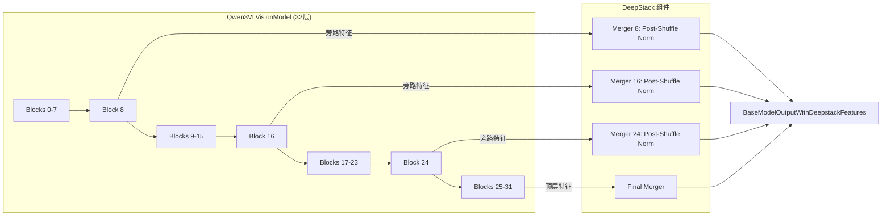
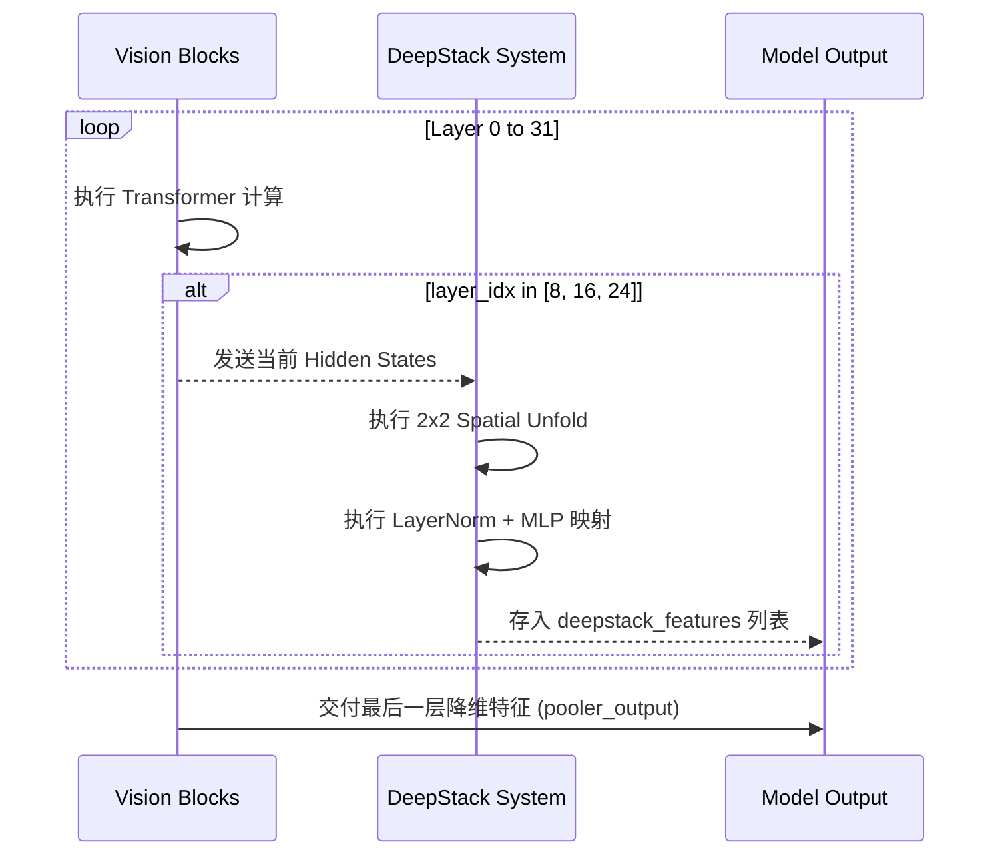
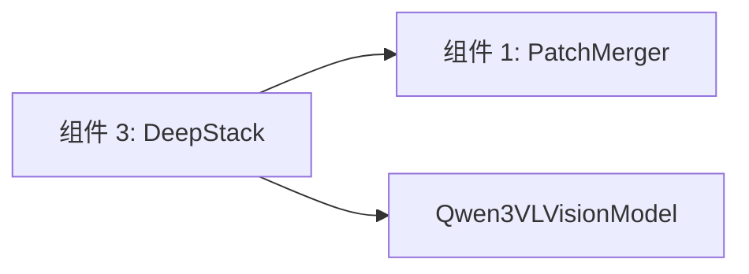

# 组件深度解析：视觉多级特征融合 (DeepStack)

## 1. 组件概述

Qwen3-VL 引入了革命性的 **DeepStack** 架构，这是视觉语言模型（VLM）领域在细粒度特征提取方面的重大突破。传统的模型（如 CLIP）仅利用视觉编码器（ViT）最后一层的特征，这虽然捕捉了全局语义，但严重丢失了像素级的细节（如微小的标点、复杂的公式线条）。

DeepStack 组件由 `Qwen3VLVisionModel` 内部的旁路机制实现。它通过在视觉塔的中部（第 8, 16, 24 层）建立“特征快车道”，将中间层提取的原始几何信息经过独立降维后，与顶层语义信息一同堆叠输出。这种“多级特征金字塔”结构，使得 Qwen3-VL 具备了类似人类视网膜般的细节感知力。

### 核心价值
- **细节零丢失**：针对 OCR 任务，DeepStack 提供了至关重要的低级形态学特征。
- **空间一致性**：中间层特征保留了更强的原始空间分布，显著提升了 2D/3D Grounding 的坐标回归精度。

## 2. 架构位置图



## 3. 核心特性表格

| 特性 | 技术实现 | 关联接口 |
| :--- | :--- | :--- |
| **层级动态截取** | 通过 `deepstack_visual_indexes` 数组配置拦截点。 | `Qwen3VLVisionModel.forward` |
| **独立投影链** | 每个拦截点拥有专属的 `Qwen3VLVisionPatchMerger` 实例。 | `self.deepstack_merger_list` |
| **Post-Shuffle Norm** | 专门针对中间层高方差特征设计的归一化策略。 | `PatchMerger.__init__` |

## 4. 文件与职责说明 [📄](file://qwen3_vl/modeling_qwen3_vl.py#L613)

- **`modeling_qwen3_vl.py`**:
    - `Qwen3VLVisionModel` (L613-L821): 统筹整个 DeepStack 的拦截与合并逻辑。
    - `BaseModelOutputWithDeepstackFeatures`: 专用数据结构，封装了 4 个不同维度的视觉张量。

## 5. 核心流程：中间层特征的高效提取



## 6. 公开接口详解

### `Qwen3VLVisionModel.forward` [📄](file://qwen3_vl/modeling_qwen3_vl.py#L758)
视觉塔的主前向传播函数，支持 DeepStack 特性。

- **返回类型**: `BaseModelOutputWithDeepstackFeatures`
- **核心字段**:
    - `last_hidden_state`: 最后一层未经 Merger 的原始特征。
    - `pooler_output`: 最后一层经过降维的特征（接入 LLM 的主路）。
    - **`deepstack_features`**: 一个 `List[torch.Tensor]`，包含了 8, 16, 24 层的降维特征。

## 7. 类型定义：DeepStack 配置参数

| 参数 | 默认值 | 物理含义 |
| :--- | :--- | :--- |
| `deepstack_visual_indexes` | `[8, 16, 24]` | 选择在哪些层进行特征拦截。 |
| `use_postshuffle_norm` | `True` | 是否在 Merger 内部的空间折叠操作后强制使用 Norm。 |

## 8. 快速开始 (查看中间层输出)

```python
model = Qwen3VLVisionModel.from_pretrained(...)
# 假设输入 pixel_values 和 grid_thw
output = model(pixel_values, grid_thw)
# 获取第 16 层的压缩特征
layer_16_feat = output.deepstack_features[1] 
```

## 9. 常见用例：DeepStack 在微调中的应用

### 场景：医疗影像识别
医疗影像（如 CT 扫描）对纹理细节极度敏感。
- **配置建议**：微调时，可以增加 `deepstack_visual_indexes` 的密度，例如 `[4, 8, 12, 16, 20, 24, 28]`。
- **效果**：大语言模型将获得更多来自浅层的纹理梯度，提升对病灶微小变化的辨识度。

## 10. 最佳实践

- **显存权衡**：每增加一个 DeepStack 索引，都会在 `forward` 过程中增加一个降维计算开销及对应的张量存储。在 2B 模型上建议保持默认的 3 个索引。
- **推理优化**：在 CPU 推理或量化模型中，如果不需要 Grounding 功能，可以手动将 `deepstack_visual_indexes` 设为空列表以提升 5-10% 的速度。

## 11. 设计决策：为何不直接用最后一层？

Qwen 团队在研发过程中发现，视觉编码器的深层往往会将“物理结构”抽象为“语义概念”。例如，一个微小的“A”字符在 24 层后，其特征向量可能已经变成了“拉丁字母”的通用语义，丢失了其字体、倾斜角度和笔画粗细。DeepStack 通过强制保留早期特征，为 LLM 提供了“原始证据”。

## 12. 内部实现原理：旁路梯度流 [📄](file://qwen3_vl/modeling_qwen3_vl.py#L805)

在训练阶段，DeepStack 形成了一个多头回归任务。
- 梯度从 LLM 的输入层出发，通过 4 个不同的 Merger 回传。
- 视觉塔的前 8 层将接收到最密集的梯度更新（来自所有 4 条路径），这使得基础视觉特征的学习极其稳健。

## 13. 错误处理

- **IndexError: list index out of range**：检查配置中的索引是否超出了 `config.depth`。
- **NaN during training**：如果关闭了 `use_postshuffle_norm` 且正在微调视觉塔，浅层特征的极差会导致数值溢出。

## 14. 依赖关系图



## 15. 相关文档链接

- [组件 1：视觉感知与降维](./组件_视觉感知与降维.md)
- [模块总览：核心模型总览](./qwen3_vl_module_overview.md)

## 16. 变更历史

- **v3.0**: 首次引入 DeepStack 技术，完全重构了 `BaseModelOutput` 返回结构。

---
*由 [Mini-Wiki v3.0.6](https://github.com/trsoliu/mini-wiki) 自动生成 | 2026-03-01*
