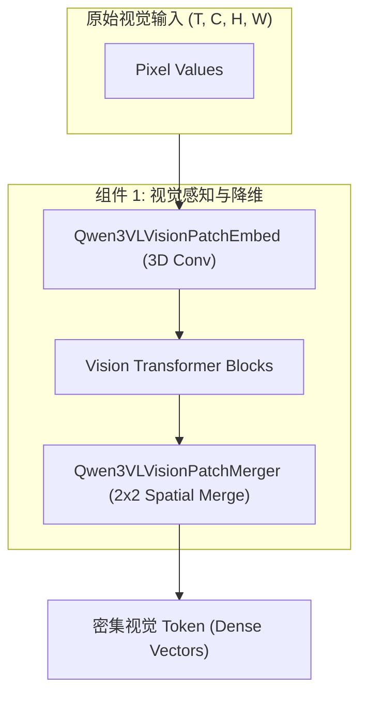
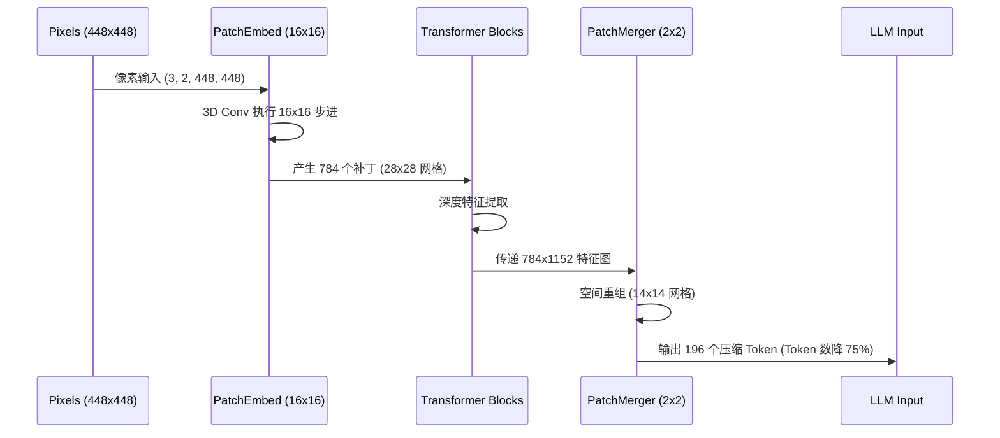
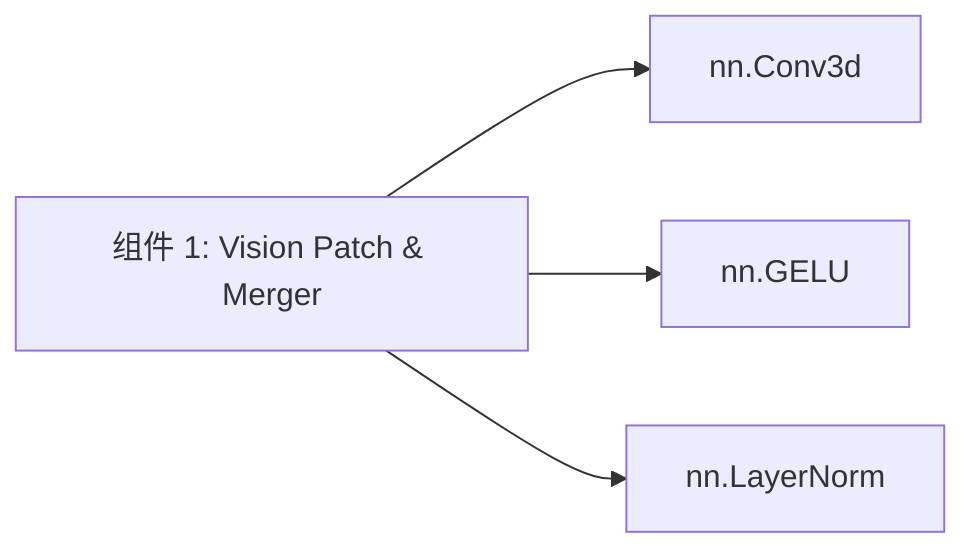

# 组件深度解析：视觉感知与降维 (Vision Patch & Merger)

## 1. 组件概述

在 Qwen3-VL 的视觉处理链路中，视觉感知与降维组件承担着从“原始像素”到“语言模型 Token”的降维映射任务。该组件由 `Qwen3VLVisionPatchEmbed` 和 `Qwen3VLVisionPatchMerger` 两个核心子模块构成。其设计目标是在保留高空间分辨率细节的同时，通过智能的空间折叠（Spatial Unfold）技术，将 Token 数量压缩 75%，从而解决视觉输入对语言大模型显存的巨大吞吐压力。

### 核心价值
- **统一时空补丁化**：通过 3D 卷积消除图像与视频的处理差异。
- **计算复杂度解耦**：利用空间合并技术，使语言模型能以较低的序列负担处理极高分辨率图像。

## 2. 架构位置图



## 3. 核心特性表格

| 特性 | 技术实现 | 关联接口 |
| :--- | :--- | :--- |
| **3D 卷积补丁化** | `nn.Conv3d` 核函数实现 $(T, H, W)$ 联合降维。 | `Qwen3VLVisionPatchEmbed.forward` |
| **2x2 空间折叠** | 将四个相邻像素块在通道维拼接以实现序列长度 $1/4$ 压缩。 | `Qwen3VLVisionPatchMerger.forward` |
| **Post-Shuffle Norm** | 在折叠拼接后立即应用归一化，抑制浅层特征波动。 | `Qwen3VLVisionPatchMerger.__init__` |

## 4. 文件与职责说明 [📄](file://qwen3_vl/modeling_qwen3_vl.py#L70)

- **`modeling_qwen3_vl.py`**: 
    - `Qwen3VLVisionPatchEmbed` (L70-L87): 负责第一层降采样，将像素转为 Embedding。
    - `Qwen3VLVisionPatchMerger` (L106-L119): 负责在进入 LLM 前的最后一层降采样。

## 5. 核心工作流：从像素到压缩 Token



## 6. 公开接口详解

### `Qwen3VLVisionPatchEmbed.forward` [📄](file://qwen3_vl/modeling_qwen3_vl.py#L81)
将输入的像素张量展平为 Embedding 序列。

- **函数签名**: `forward(self, hidden_states: torch.Tensor) -> torch.Tensor`
- **参数**: `hidden_states` (B, C, T, H, W) 维度的视觉张量。
- **代码示例**:
```python
import torch
from qwen3_vl.modeling_qwen3_vl import Qwen3VLVisionPatchEmbed
# 模拟 448x448 分辨率，2帧视频输入
pixel_values = torch.randn(1, 3, 2, 448, 448) 
# 实例化补丁层
embedder = Qwen3VLVisionPatchEmbed(config) 
# 输出 shape: [1, 784, 1152] (28*28 = 784)
output = embedder(pixel_values) 
```

## 7. 类型定义：维度变换参考

| 阶段 | 张量形状 (以 448x448 为例) | 维度语义 |
| :--- | :--- | :--- |
| 输入像素 | `(3, 2, 448, 448)` | `(C, T, H, W)` |
| PatchEmbed 后 | `(784, 1152)` | `(SeqLen, Hidden)` |
| Merger 拼接后 | `(196, 4608)` | `(SeqLen/4, Hidden*4)` |
| Merger 投影后 | `(196, 3584)` | `(SeqLen/4, LLM_Dim)` |

## 8. 快速开始

```python
from qwen3_vl.configuration_qwen3_vl import Qwen3VLVisionConfig
from qwen3_vl.modeling_qwen3_vl import Qwen3VLVisionPatchEmbed

config = Qwen3VLVisionConfig(patch_size=16, temporal_patch_size=2)
patch_layer = Qwen3VLVisionPatchEmbed(config)
# 只要输入符合 (B, C, T, H, W) 即可直接处理
```

## 9. 常见用例与形状追踪

### 用例：极高分辨率 (1344x1344) 推演
1. **PatchEmbed**: 产生 $1344/16 	imes 1344/16 = 84 	imes 84 = 7056$ 个补丁。
2. **Vision Blocks**: 在 7056 Token 长度下执行计算。
3. **PatchMerger**: 执行 $2 	imes 2$ 合并，输出 $(84/2) 	imes (84/2) = 42 	imes 42 = 1764$ 个 Token。
4. **结论**: 将 7000+ 的长序列压缩至 1700+，使得 32B 模型在单卡 A100 上仍有余力处理文本。

## 10. 最佳实践

- **整除性警告**：输入图像的 $H$ 和 $W$ 必须能被 `patch_size * spatial_merge_size` (即 32) 整除。否则 `qwen-vl-utils` 会在预处理阶段强制进行 `smart_resize`。
- **精度建议**：如果对小文字识别要求极高，可以修改 `grid_thw` 的生成策略以跳过 `PatchMerger`，但需注意 LLM 侧的 OOM 风险。

## 11. 设计决策：为何选用 3D 卷积？

在 Qwen2-VL 中，图像使用的是 2D 卷积。Qwen3-VL 统一为 3D 卷积的主要权衡：
- **收益**：模型不再区分“静态图”和“动态帧”。对于静态图，其 $T=2$ 只是相同特征的冗余表达，但在特征提取层级可以完全复用视频的预训练权重，极大提升了模型对动作指令的理解一致性。

## 12. 内部实现原理：空间重组 (Spatial Unfold) [📄](file://qwen3_vl/modeling_qwen3_vl.py#L775)

在 `Qwen3VLVisionModel.forward` 中，Merger 之前的重组逻辑如下：
```python
# 逻辑伪代码
# 将 Seq 维度恢复为 (T, H, W) 网格
# 对 H, W 执行 Unfold 操作，提取 2x2 的邻域
# 将 2x2 的邻域 Patch 拼接到维度维 (Channel Dimension)
# 最终形状从 (H, W, C) 变为 (H//2, W//2, C*4)
```
这是通过复杂的 `view`, `permute` 组合实现的，目的是保证空间邻近的特征在语义空间中也能“抱团”降维。

## 13. 错误处理

- **RuntimeError: view size mismatch**：通常是因为 `grid_thw` 提供的信息与实际像素张量尺寸不符。
- **CUDA OOM in Vision Tower**：发生在 `Blocks` 阶段。解决方案是开启 `gradient_checkpointing`。

## 14. 依赖关系图



## 15. 相关文档链接

- [模块总览：AI 系统核心模型总览](./qwen3_vl_module_overview.md)
- [组件 2：多维旋转位置编码 MRoPE](./组件_多维位置编码.md)

## 16. 变更历史

- **v3.0**: 引入 `use_postshuffle_norm` 优化 DeepStack 兼容性。
- **v3.0**: Patch 步幅从 Qwen2 的固定 14 升级为 16，并兼容 3D 卷积。

---
*由 [Mini-Wiki v3.0.6](https://github.com/trsoliu/mini-wiki) 自动生成 | 2026-03-01*
