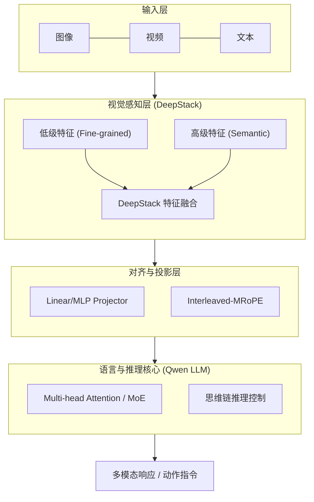
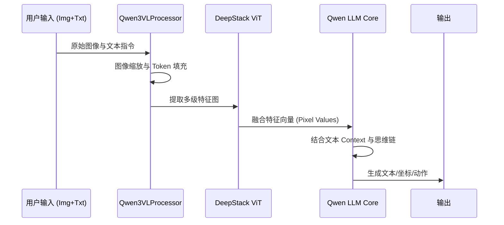

# Qwen3-VL 系统架构

## 1. 架构概述

Qwen3-VL 采用了先进的多模态融合架构，旨在实现图像、视频和文本的无缝对齐。其核心设计理念是通过高分辨率视觉感知、长时序视频建模和深度推理能力的结合，构建一个能够理解、定位并操作现实世界的通用多模态智能体。

### 关键技术栈
- **基础框架**: PyTorch, Hugging Face Transformers
- **模型架构**: Dense / MoE (Mixture of Experts)
- **视觉编码**: DeepStack ViT (多级特征融合)
- **位置编码**: Interleaved-MRoPE (多模态旋转位置嵌入)
- **训练方案**: SFT (指令微调), Thinking (推理增强)

## 2. 系统架构图

## 3. 核心组件详解

### 3.1 DeepStack 视觉感知 [📄](file://qwen3_vl/modeling_qwen3_vl.py#L65)
DeepStack 架构通过融合 ViT (Vision Transformer) 的多级特征图，能够同时捕捉图像的精细局部细节（用于 OCR 和 Grounding）和全局语义信息（用于场景理解）。
- **组件**: `BaseModelOutputWithDeepstackFeatures`
- **优势**: 显著提升了小物体检测和复杂文档解析的准确率。

### 3.2 Interleaved-MRoPE [📄](file://qwen3_vl/modeling_qwen3_vl.py#L94)
Qwen3-VL 引入了交错式多模态旋转位置嵌入（Interleaved-MRoPE），在时间、宽度和高度三个维度上分配位置信息。
- **作用**: 增强了长视频的推理能力，使模型能够精确进行视频内事件的秒级定位。
- **配置**: 在 `config.json` 中通过 `rope_scaling` 进行 factor 调整。

### 3.3 视觉-文本交错处理器 [📄](file://qwen3_vl/processing_qwen3_vl.py#L40)
`Qwen3VLProcessor` 负责将各种模态的数据转化为模型可接受的 Tensor，并自动插入特殊 Token（如 `<|vision_start|>`, `<|image_pad|>`）。
- **空间表示**: 使用 `image_grid_thw` 和 `video_grid_thw` 来保留视觉输入的 3D 空间结构信息。

## 4. 数据流分析

## 5. 目录结构与职责 [📄](file://README.md)

| 目录/文件 | 职责说明 |
| :--- | :--- |
| `qwen3_vl/` | 核心模型定义，包含建模 (`modeling_qwen3_vl.py`) 和处理逻辑。 |
| `qwen-vl-utils/` | 视觉处理工具包，负责图像/视频的加载与预处理。 |
| `qwen-vl-finetune/` | 微调框架，支持对 LLM、Vision 模块或 Projection 层进行 SFT/LoRA 训练。 |
| `evaluation/` | 各大主流视觉语言评测基准的自动化脚本（MathVision, MMMU 等）。 |
| `cookbooks/` | 交互式教程，涵盖 OCR、Grounding、Agent 等多种应用场景。 |

---
**相关文档**
- [项目首页](index.md)
- [快速开始](getting-started.md)
- [API 详细参考](api/_index.md)

*由 [Mini-Wiki v3.0.6](https://github.com/trsoliu/mini-wiki) 自动生成 | 2026-03-01*
