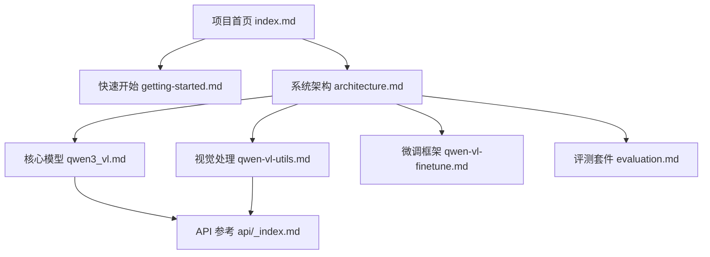

# 文档图谱 (Document Map)

本页面展示了 Qwen3-VL 项目所有 Wiki 文档的组织结构与依赖关系，帮助您快速找到所需信息。

## 🗺️ 文档关系图

## 📂 目录结构索引

### 1. 基础指引 (Foundations)
- [项目首页 (index.md)](index.md): 项目背景、核心特性预览、快速导航。
- [系统架构 (architecture.md)](architecture.md): 全面解析 DeepStack, MRoPE, 数据流与模块依赖。
- [快速开始 (getting-started.md)](getting-started.md): 环境安装、基础代码示例、Web Demo 启动。

### 2. 核心模块 (Core Modules)
- [核心模型 (qwen3_vl.md)](modules/qwen3_vl.md): 模型类定义、DeepStack 索引、位置嵌入细节。
- [视觉处理 (qwen-vl-utils.md)](modules/qwen-vl-utils.md): 动态分辨率、Smart Resize、多端视频解码方案。
- [微调框架 (qwen-vl-finetune.md)](modules/qwen-vl-finetune.md): SFT/LoRA 训练配置、数据打包 (Packing) 与 MoE 限制。
- [评测套件 (evaluation.md)](modules/evaluation.md): 两阶段评测、vLLM 推理、GPT-4o 评判与得分统计。

### 3. API 参考 (API Reference)
- [API 概览 (api/_index.md)](api/_index.md): 所有公共类、函数及其导入方式的索引。

## 💡 推荐阅读路径

| 您的角色 | 推荐路径 |
| :--- | :--- |
| **快速体验者** | `index.md` -> `getting-started.md` -> `Web Demo` |
| **算法工程师** | `architecture.md` -> `modules/qwen3_vl.md` -> `modules/qwen-vl-finetune.md` |
| **评测/复现者** | `getting-started.md` -> `modules/evaluation.md` |
| **集成开发者** | `modules/qwen-vl-utils.md` -> `api/_index.md` |

---
**相关文档**
- [项目首页](index.md)
- [系统架构](architecture.md)

*由 [Mini-Wiki v3.0.6](https://github.com/trsoliu/mini-wiki) 自动生成 | 2026-03-01*
