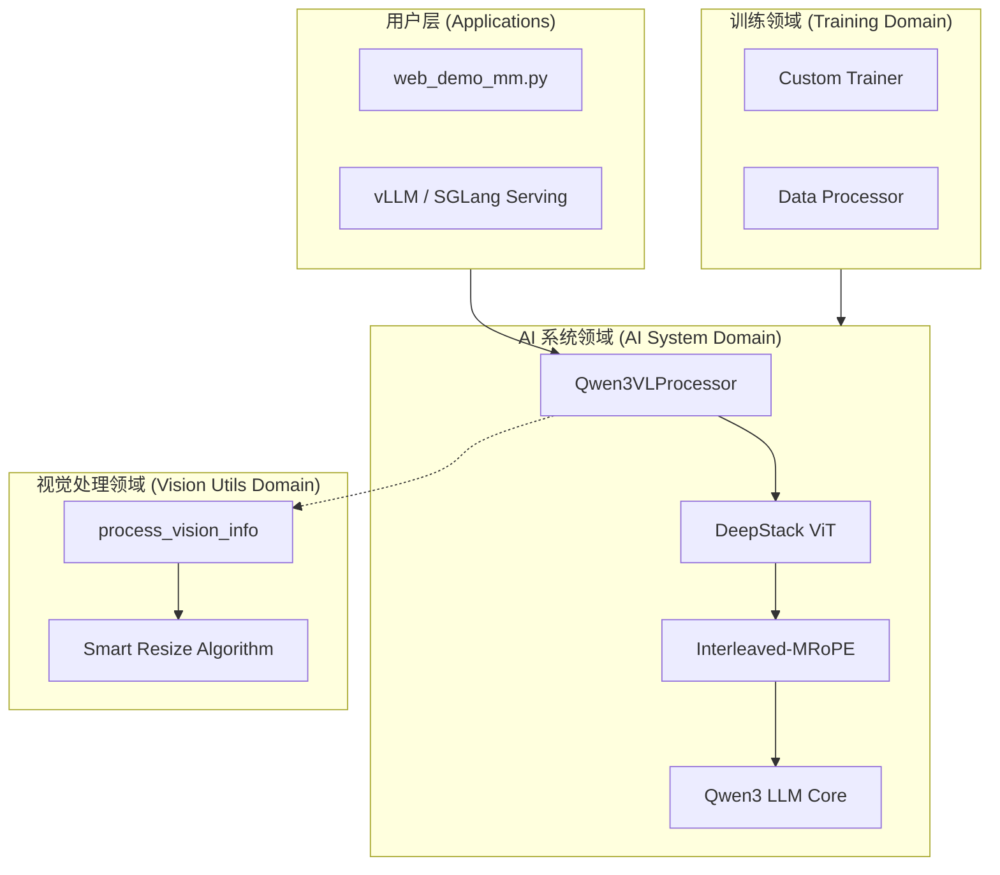

# Qwen3-VL 专业技术 Wiki

    

Qwen3-VL 是 Qwen 系列中性能最强、支持最全面的视觉语言模型。本项目 Wiki 旨在为开发者提供深度架构分析、详尽的 API 参考及生产级部署建议。

## 🌐 业务领域导航 (Domain Navigation)

| 业务领域 | 核心模块 | 职责描述 |
| :--- | :--- | :--- |
| **[AI 系统 / 模型核心](./AI系统/核心模型.md)** | `qwen3_vl` | 定义 DeepStack 架构、Interleaved-MRoPE 及多模态融合逻辑。 |
| **[视觉处理](./视觉处理/预处理工具.md)** | `qwen-vl-utils` | 负责图像/视频的高效加载、Smart Resize 及动态 Token 预算控制。 |
| **[训练与微调](./训练系统/微调框架.md)** | `qwen-vl-finetune` | 提供 SFT、LoRA 训练能力及大规模数据打包 (Packing) 优化。 |
| **[评测体系](./评测系统/基准测试.md)** | `evaluation` | 集成 MathVision、MMMU 等主流 VLM 评测集的自动化高并发推理与评分。 |

## 🏗️ 全局系统架构 (System Architecture)

## 📈 项目核心指标 (Key Statistics)
- **上下文长度**: 原生 256K，最高支持 1M (YaRN)。
- **语言支持**: OCR 支持 32 种语言，推理支持全球主流语言。
- **架构**: 支持 Dense 及 MoE。
- **性能**: 在 MathVision, MMMU 处于行业顶尖水平。

---
**相关文档**
- [系统架构分析](architecture.md)
- [快速开始指引](getting-started.md)
- [文档依赖全景图](doc-map.md)

*由 [Mini-Wiki v3.0.6](https://github.com/trsoliu/mini-wiki) 自动生成 | 2026-03-01*
