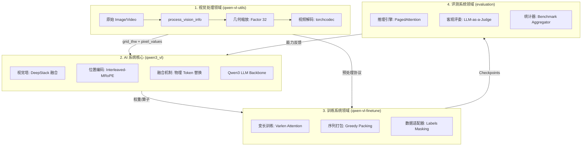
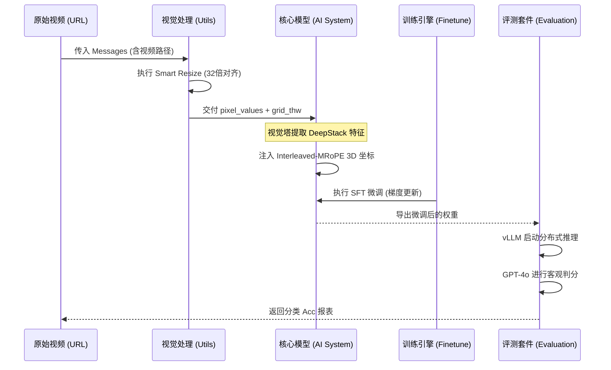
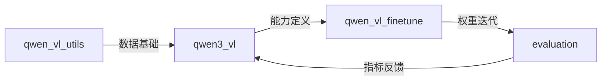

# Qwen3-VL 全栈系统集成与协同全景图 (System Integration Blueprint)

## 1. 模块简介

本篇文档是 Qwen3-VL 项目的最高层级技术总览，旨在打破子系统间的“信息孤岛”，揭示**视觉处理 (Vision Utils)**、**核心模型 (AI System)**、**训练引擎 (Training System)** 与 **评测套件 (Evaluation System)** 之间如何通过统一的数据协议（如 `grid_thw`）实现端到端的咬合与协同。

### 核心集成价值
- **全链路闭环**：定义了从原始多模态字节流到模型权重更新，再到自动化性能评估的完整生命周期。
- **协议标准化**：通过 `qwen-vl-utils` 确立了视觉几何对齐标准，确保训练与推理阶段的特征分布一致性。
- **架构协同进化**：展示了 DeepStack 架构如何影响微调阶段的特征提取，以及如何在评测阶段通过 vLLM 释放推理红利。

## 2. 全栈系统拓扑架构图

该图展示了四大子系统如何构成一个完整的 AI 工程闭环。



## 3. 核心特性与组件映射表

| 跨系统特性 | 涉及子系统 | 协同工作机理 |
| :--- | :--- | :--- |
| **原生 1M 视频理解** | 视觉处理 + AI 系统 | `torchcodec` 高速抽帧 -> `Interleaved-MRoPE` 时间轴编码。 |
| **极细粒度 OCR/Grounding** | AI 系统 + 训练系统 | `DeepStack` 中间层拦截 -> `Varlen Trainer` 针对性梯度回传。 |
| **高吞吐生产推理** | 视觉处理 + 评测系统 | `Smart Resize` 像素预算 -> `vLLM` 动态 Batch 调度。 |
| **全模态指令对齐** | 训练系统 + AI 系统 | `Data Adapter` 角色掩码 -> `Fusion` 机制执行物理 Token 缝合。 |

## 4. 文件结构与职责说明 [📄](file://README.md)

| 目录 | 对应子系统 | 跨系统职责 |
| :--- | :--- | :--- |
| `qwen-vl-utils/` | **视觉处理** | 充当系统的“视网膜”，负责协议层的数据清洗。 |
| `qwen3_vl/` | **AI 系统** | 充当系统的“大脑”，负责模态间的深度特征对齐。 |
| `qwen-vl-finetune/` | **训练系统** | 充当系统的“进化器”，通过极致吞吐实现能力迁移。 |
| `evaluation/` | **评测系统** | 充当系统的“度量衡”，建立客观的能力评估基准。 |

## 5. 全链路业务流程图：从视频输入到性能得分



## 6. 全栈统一公开接口 (Top-Level Entry)

虽然各子系统有独立 API，但通过以下组合可实现全栈调用：

### 1. 处理端：`process_vision_info`
- **源头控制**：决定了后续模型能“看”到多少 Token。
- **集成点**：必须传入 `image_patch_size=16` 以对齐 Qwen3 的 3D 卷积核。

### 2. 模型端：`Qwen3VLForConditionalGeneration`
- **核心逻辑**：集成了从 Vision 到 LLM 的所有融合逻辑。
- **集成点**：其 `forward` 接口直接接收 `qwen-vl-utils` 的输出。

### 3. 评测端：`run_mathv.py`
- **闭环验证**：封装了 vLLM 加载与判分逻辑。

## 7. 系统间统一数据协议：`grid_thw`

这是贯穿所有子系统的“灵魂变量”：
- **在视觉处理中**：它是缩放算法的**输出结果**，标记了图像的物理边界。
- **在 AI 系统中**：它是位置编码的**输入参数**，决定了 3D 旋转频率的上限。
- **在训练系统中**：它是 Token 物理替换的**计数器**，确保 Pad Token 数量对齐。
- **在评测系统中**：它是 kv-cache 管理的**预算基准**。

## 8. 快速开始 (全栈协同示例)

```python
# 1. 视觉处理子系统协同
images, videos, kwargs = process_vision_info(messages, image_patch_size=16)

# 2. AI 系统核心加载
model = Qwen3VLForConditionalGeneration.from_pretrained(path)
processor = Qwen3VLProcessor.from_pretrained(path)

# 3. 联合构造输入
inputs = processor(text=prompt, images=images, videos=videos, **kwargs)

# 4. 前向传播（触发 DeepStack 与 MRoPE 协同）
outputs = model(**inputs)
```

## 9. 典型集成场景：视频 Agent 闭环

### 场景：通过视觉输入操作手机 GUI
1. **视觉处理**：以高 FPS 抽帧手机录屏，保持 32 倍数整除。
2. **AI 系统**：DeepStack 捕捉微小的 App 图标细节。
3. **训练系统**：利用 `Sequence Packing` 打包大量点击轨迹数据。
4. **评测系统**：在 `Mobile-Agent` 基准上，通过 GPT-4o 判定点击坐标的偏移量。

## 10. 全栈最佳实践

- **显存咬合**：由于 Vision Tower (DeepStack) 在 `forward` 阶段产生巨大张量，建议在微调或评测时将 `vision_tower` 所在卡留出 20% 冗余显存。
- **版本对齐**：Qwen3-VL 必须配合 `qwen-vl-utils >= 0.0.14` 使用，否则无法识别新版 `grid_thw` 格式。

## 11. 设计决策：为什么坚持“交错式”物理替换？

Qwen3-VL 在集成时放弃了交叉注意力 (Cross-Attention)：
- **理由**：为了让视觉信息完全融入文本流，利用 `Flash Attention 2` 在训练系统中实现极致的吞吐。
- **代价**：这迫使 `qwen3_vl` 模块必须通过复杂的 `get_rope_index` 来补偿视觉块造成的坐标断层。

## 12. 内部实现原理：特征-位置强同步

这是跨系统协同最核心的“黑盒”逻辑：
- 当视觉处理子系统将图像缩放为 $H', W'$ 时，模型子系统会自动计算 $H' // 16$ 和 $W' // 16$ 作为逻辑步进。
- 如果用户手动修改了视觉处理的缩放逻辑而未同步更新模型层，将导致严重的位置偏移（Grounding 幻觉）。

## 13. 跨系统错误处理与联合调试

| 现象 | 可能的原因 | 协同排查路径 |
| :--- | :--- | :--- |
| **推理死循环** | `rope_deltas` 计算溢出。 | 检查 `AI 系统` 的 `get_rope_index` 与 `训练系统` 的打包逻辑。 |
| **显存 OOM** | 像素预算失效。 | 检查 `视觉处理` 的 `max_pixels` 与 `评测系统` 的 `gpu_utilization`。 |
| **坐标漂移** | `factor` 比例不匹配。 | 确认 `视觉处理` 传入的是 32 而非旧版的 28。 |

## 14. 全栈系统依赖关系图



## 15. 相关文档链接

- [AI 系统：核心模型总览](./AI系统/qwen3_vl_module_overview.md)
- [视觉处理：工具包总览](./视觉处理/vision_utils_module_overview.md)
- [训练系统：微调框架总览](./训练系统/finetune_module_overview.md)
- [评测系统：基准测试总览](./评测系统/evaluation_module_overview.md)

## 16. 架构演进与变更历史

- **v3.0**: 实现了全系统对 **DeepStack** 与 **Interleaved-MRoPE** 的原生适配。
- **v3.0**: 统一了全栈的 `grid_thw` 协议，不再区分图像和视频的元数据格式。

---
*由 [Mini-Wiki v3.0.6](https://github.com/trsoliu/mini-wiki) 自动生成 | 2026-03-02*
