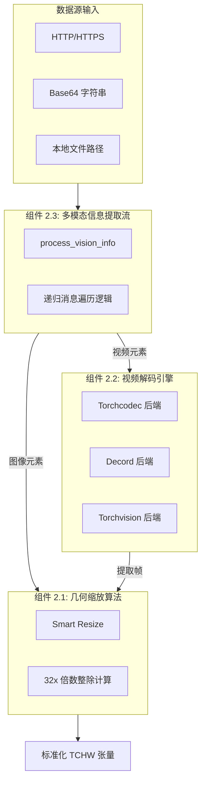
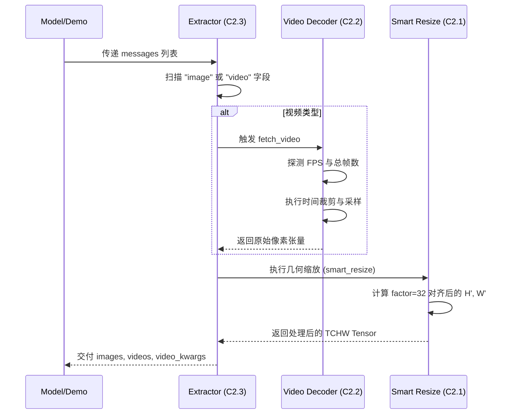
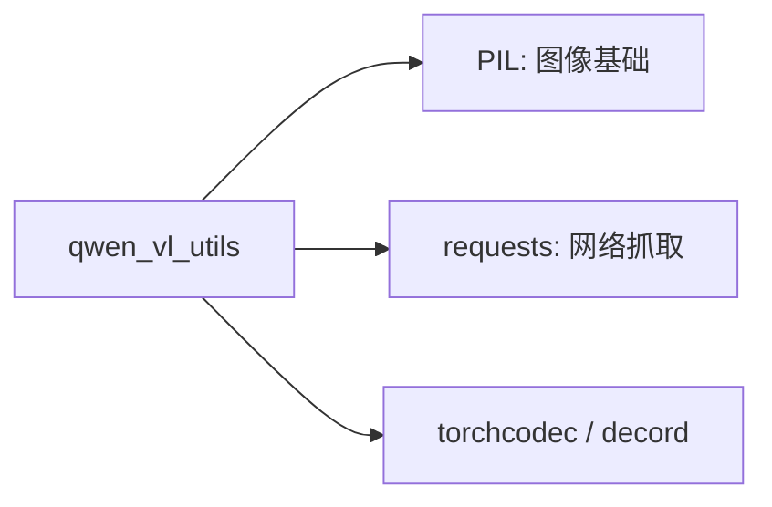

# 视觉处理：Qwen-VL 预处理工具总览 (qwen-vl-utils)

## 1. 模块简介

`qwen-vl-utils` 是 Qwen-VL 系列模型的“视觉视网膜”。作为一个独立的基础设施模块，它承担了将互联网级异构数据（URL、Base64、本地文件）转化为模型所需的标准化、几何对齐张量的核心任务。该模块不仅解决了多模态模型对输入尺寸的严苛要求（如必须被 32 整除），还通过多后端适配器解决了长视频解码的性能瓶颈。

### 核心价值
- **几何确定性**：确保视觉 Token 数量在推理前可被精确预估，避免因尺寸不当导致的显存突发性溢出。
- **性能鲁棒性**：针对不同硬件环境自动切换视频解码后端，确保在 H100 或个人电脑上均能实现秒级解析。
- **内存安全预算**：内置 `pixel_control` 机制，允许在超大规模 Batch 推理中进行细粒度的像素控制。

## 2. 模块内组件拓扑架构图

该图展示了视觉信息如何从原始字节流经过组件间的咬合，最终变为结构化的 Tensor 数据。



## 3. 核心特性与组件映射表

| 核心特性 | 技术实现路径 | 涉及组件 |
| :--- | :--- | :--- |
| **像素级预算控制** | 利用 `max_pixels` 动态计算缩放比例。 | 组件 2.1 |
| **全后端视频兼容** | 基于 C++ 绑定的 `torchcodec/decord` 高速调度。 | 组件 2.2 |
| **自动化 Token 预估** | 导出 `video_grid_thw` 元数据供模型使用。 | 组件 2.3 |
| **时间切片提取** | 精准的 `pts` 帧定位与按秒裁剪。 | 组件 2.2 |

## 4. 文件结构与职责说明 [📄](file://qwen-vl-utils/README.md)

| 文件名 | 核心职责 | 对应组件 |
| :--- | :--- | :--- |
| `vision_process.py` | 核心逻辑实现。包含 Resize 算法、视频读取类及主入口。 | 组件 2.1, 2.2, 2.3 |
| `__init__.py` | 暴露 `process_vision_info` 等公共 API。 | 全局统筹 |
| `pyproject.toml` | 管理 `decord` 等可选 C++ 扩展的安装依赖。 | 基础设施 |

## 5. 组件协同全链路流程图



## 6. 公开接口详解 (总入口)

### `process_vision_info` [📄](file://qwen-vl-utils/src/qwen_vl_utils/vision_process.py#L480)
这是连接“外部应用”与“视觉处理”的唯一标准接口。

- **`image_patch_size`**: 决定了基础 Patch 大小。Qwen3-VL 传入 16。
- **`return_video_kwargs`**: 如果开启，将返回包含 `video_grid_thw` 的字典，这是接入 `Qwen3VLModel` 的必需参数。

## 7. 组件间统一数据结构

- **`ele` (Element Dictionary)**: 包含 `video_start`, `video_end`, `fps`, `max_pixels` 等控制参数。
- **`grid_thw`**: 经过组件 2.1 处理后生成的元数据，指示了该视觉块在模型内部占据的逻辑网格。

## 8. 快速开始 (组件协同示例)

```python
from qwen_vl_utils import process_vision_info

# 构造包含视频片段的复杂输入
messages = [
    {
        "role": "user",
        "content": [
            {"type": "video", "video": "sample.mp4", "video_start": 10.0, "video_end": 20.0},
            {"type": "text", "text": "描述第10秒到20秒的内容。"}
        ]
    }
]

# 内部将自动触发：
# 1. 组件 2.2 进行视频定位
# 2. 组件 2.1 进行尺寸缩放
# 3. 组件 2.3 进行列表封装
images, videos, video_kwargs = process_vision_info(messages, image_patch_size=16)
```

## 9. 典型场景：显存受限下的极速推理

在只有 24G 显存的环境下推理超长视频：
```python
messages = [{"role": "user", "content": [{"type": "video", "video": "long.mp4", "total_pixels": 24576 * 32 * 32}]}]
# 内部组件 2.1 将根据 total_pixels 自动降低每一帧的分辨率，保证 Token 总数不超标。
```

## 10. 最佳实践 (Best Practices)

- **环境优先设置**：手动安装 `torchcodec` 并设置 `FORCE_QWENVL_VIDEO_READER=torchcodec`，相比默认的 `torchvision` 能获得 **3-5 倍** 的解析提速。
- **Patch 对齐**：Qwen3-VL 务必传入 `image_patch_size=16`，否则会导致 `smart_resize` 算出的形状无法被模型 3D 卷积核整除。

## 11. 设计决策：为何选择 32 倍数整除？

- **推导逻辑**：Qwen3-VL 视觉塔先进行 `patch_size=16` 的卷机，随后进行 `spatial_merge_size=2` 的特征合并。
- **数学约束**：为了保证 $H / 16 / 2$ 是整数，原始输入的 $H$ 必须能被 $16 	imes 2 = 32$ 整除。
- **收益**：避免了在 Merger 层出现非齐次的 Padding 特征，提升了空间定位的准确度。

## 12. 内部实现原理：递归展开算法

`process_vision_info` 内部采用递归深度优先搜索（DFS）遍历消息中的 `content`：
- 将所有的 `Image.Image` 对象或路径统一转换为 RGB 格式。
- 将视频帧序列与单张图在最终输出时进行对齐，提供一致的 Batch 接口。

## 13. 跨组件错误处理

| 错误信息 | 原因分析 | 排查组件 |
| :--- | :--- | :--- |
| `ValueError: aspect ratio must be smaller than 200` | 输入了极其扁长的图片。 | 组件 2.1 (Smart Resize) |
| `Decord hang/crash` | 视频索引越界或多线程冲突。 | 组件 2.2 (Video Backend) |
| `None values in outputs` | 消息格式不符合 `role/content` 规范。 | 组件 2.3 (Extractor) |

## 14. 模块依赖关系图



## 15. 相关文档链接

- [组件 2.1 详解：几何缩放算法](./组件_几何缩放.md)
- [组件 2.2 详解：视频解码引擎](./组件_视频解码.md)
- [组件 2.3 详解：信息提取流](./组件_提取流.md)

## 16. 变更历史

- **v0.0.14**: 增加了对 `torchcodec` 的原生支持。
- **v0.0.14**: 引入 `image_patch_size` 参数化配置，兼容 Qwen2.5 和 Qwen3。

---
*由 [Mini-Wiki v3.0.6](https://github.com/trsoliu/mini-wiki) 自动生成 | 2026-03-01*
