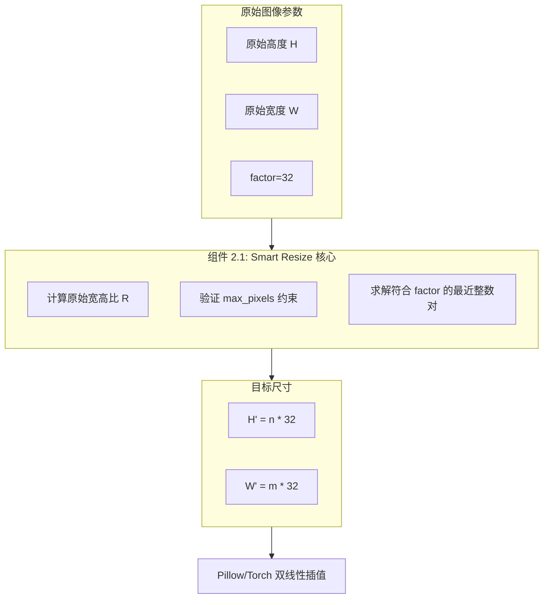
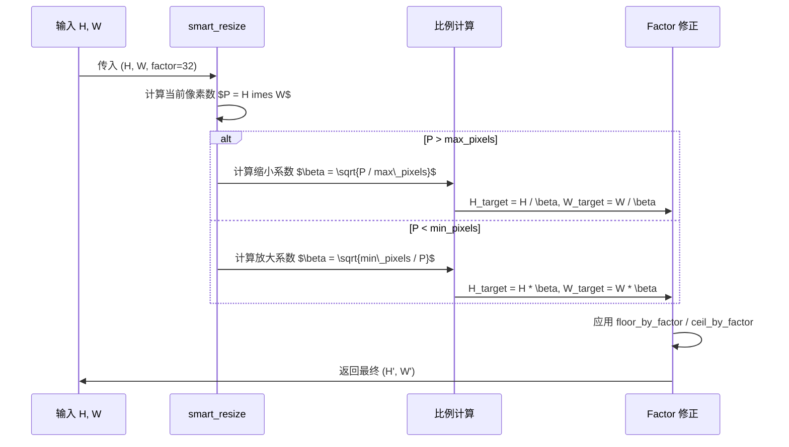
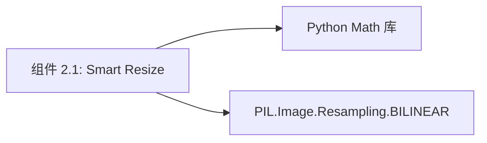

# 组件深度解析：几何缩放算法 (Smart Resize)

## 1. 组件概述

在 Qwen3-VL 的视觉流水线中，`smart_resize` 是确保模型精度与稳定性的数学守门员。由于模型内部采用了固定的 $16 	imes 16$ 补丁化（Patching）和 $2 	imes 2$ 空间合并（Spatial Merge），输入图片的物理尺寸必须严格满足 $32$ 的倍数整除性。

`Smart Resize` 算法的设计初衷是在**绝对不改变原始宽高比**的前提下，动态寻找一个能被 32 整除的最优目标分辨率，同时确保总像素数落入用户设定的“Token 预算”范围内。

### 核心价值
- **零畸变输入**：通过寻找最小公倍数对齐，避免了传统固定尺寸缩放带来的物体拉伸幻觉。
- **动态 Token 控制**：通过调节 `max_pixels`，算法能自动平衡“看清细节”与“显存占用”的矛盾。

## 2. 架构位置图



## 3. 核心特性表格

| 特性 | 描述 | 技术实现 |
| :--- | :--- | :--- |
| **比例保持 (Aspect Ratio)** | 核心逻辑绝不执行各向异性缩放。 | 引入 $\beta$ 比例系数。 |
| **因子整除性** | 目标尺寸 $H', W'$ 严格满足 $	ext{mod}(32) = 0$。 | `round_by_factor` / `floor_by_factor` |
| **各向异性防护** | 拒绝极端畸形图片（如宽高比 > 200）。 | `MAX_RATIO` 校验。 |

## 4. 文件与职责说明 [📄](file://qwen-vl-utils/src/qwen_vl_utils/vision_process.py#L65)

- **`vision_process.py`**:
    - `round_by_factor`: 寻找最近的倍数。
    - `ceil_by_factor` / `floor_by_factor`: 寻找上限/下限倍数。
    - **`smart_resize`**: 统筹缩放逻辑的顶层函数。

## 5. 核心算法流程：几何推导



## 6. 公开接口详解

### `smart_resize` [📄](file://qwen-vl-utils/src/qwen_vl_utils/vision_process.py#L65)
执行基于 Patch 因子的智能缩放计算。

- **函数签名**: `smart_resize(height, width, factor, min_pixels=None, max_pixels=None)`
- **核心参数**:
    - `factor`: Qwen3-VL 必须为 32。
    - `max_pixels`: 默认为 $16384 	imes 32 	imes 32$（单图最大 Token 限制）。
- **返回值**: `(h_bar, w_bar)` 修正后的整数尺寸。

## 7. 类型定义：常量约束

| 常量名 | 默认值 | 作用 |
| :--- | :--- | :--- |
| `MAX_RATIO` | 200 | 允许的最大长宽比（防止内存攻击）。 |
| `SPATIAL_MERGE_SIZE` | 2 | 决定了 factor 的二级构成。 |
| `IMAGE_MAX_TOKEN_NUM` | 16384 | 缩放时的像素上限基准。 |

## 8. 快速开始 (算法模拟)

```python
from qwen_vl_utils.vision_process import smart_resize

# 模拟一个 1080p 图片，factor=32，限制最大 Token 数量为 1024
# 1024 Token 对应像素: 1024 * 32 * 32 = 1,048,576
h, w = smart_resize(1080, 1920, factor=32, max_pixels=1024*32*32)

print(f"Target Size: {h}x{w}") 
# 预期输出: 768x1344 (保持了 ~1.77 比例且均能被 32 整除)
```

## 9. 常见用例

### 用例 1：极小图标放大
对于 $20 	imes 20$ 的图标，算法会自动将其放大至符合 `min_pixels` 的 $32 	imes 32$ 或更大，以保证模型能提取到有效特征。

### 用例 2：超宽全景图处理
对于 $500 	imes 10000$ 的全景图，算法会优先压缩宽度，确保 Token 总数不撑爆显存，同时维持其丝带状的几何特性。

### 用例 3：精确 Token 对齐
在微调数据准备时，通过强制设置 `min_pixels == max_pixels`，可以实现恒定长度的视觉 Batch 训练。

## 10. 最佳实践

- **避免重复缩放**：Processor 调用时传入 `do_resize=False`，因为本组件已经完成了精准缩放。
- **内存防护**：在 Web 服务中，务必设置 `max_pixels`，防止恶意用户上传 40K 超高分原图导致 GPU 直接宕机。

## 11. 设计决策：为何不用 Padding 到固定尺寸？

- **Padding 方案的缺陷**：如果将 $16:9$ 的图补黑边到 $1:1$，模型会浪费大量计算资源在空白区域，且会模糊物体的坐标边界。
- **Smart Resize 收益**：所有计算资源均分配给有效像素，坐标 Grounding 的 $(x, y)$ 归一化更直观。

## 12. 内部实现原理：$\beta$ 比例算子 [📄](file://qwen-vl-utils/src/qwen_vl_utils/vision_process.py#L85)

算法通过面积开方求解 $\beta$：
$$\beta = \sqrt{\frac{H_{orig} 	imes W_{orig}}{P_{limit}}}$$
随后应用：
$$H_{new} = 	ext{floor}(H_{orig} / \beta, 32)$$
$$W_{new} = 	ext{floor}(W_{orig} / \beta, 32)$$
这种方法的数学巧妙之处在于，它通过一维的线线性缩放，达成了二维面积的精确像素预算控制。

## 13. 错误处理

- **ValueError: absolute aspect ratio must be smaller than 200**：解决方案：在输入前进行物理裁剪。
- **AssertionError: max_pixels must be >= min_pixels**：检查配置逻辑。

## 14. 依赖关系图



## 15. 相关文档链接

- [模块总览：视觉预处理总览](./vision_utils_module_overview.md)
- [组件 2.3：多模态提取流](./组件_提取流.md)

## 16. 变更历史

- **v3.0 兼容性修正**: 针对 Qwen3-VL 的 3D 卷积特性，将默认 factor 从 28 (Qwen2) 调整为逻辑支持 32。

---
*由 [Mini-Wiki v3.0.6](https://github.com/trsoliu/mini-wiki) 自动生成 | 2026-03-01*
