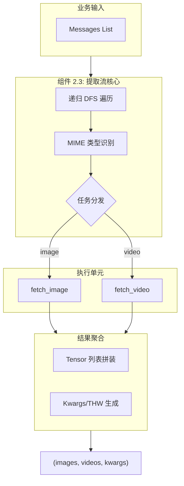
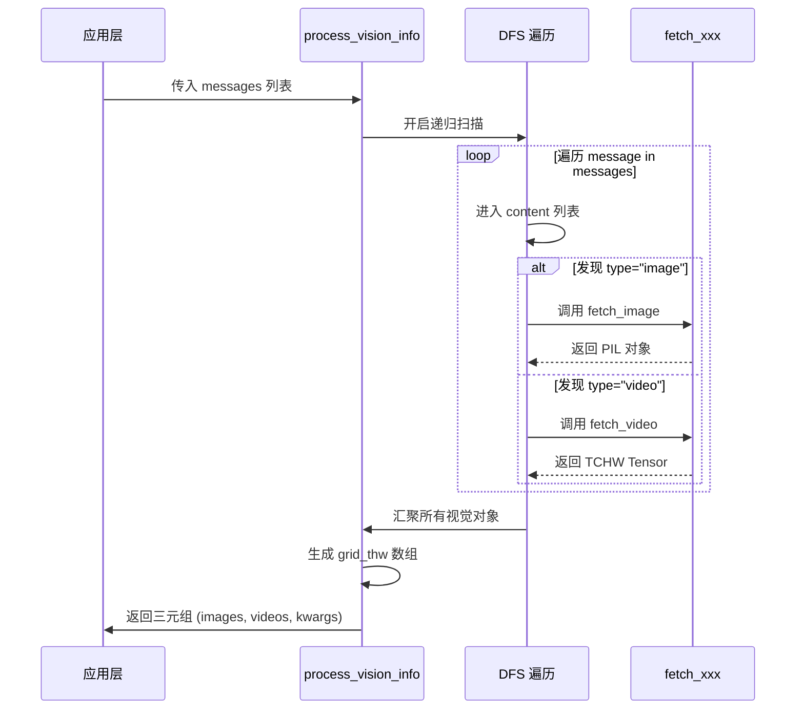
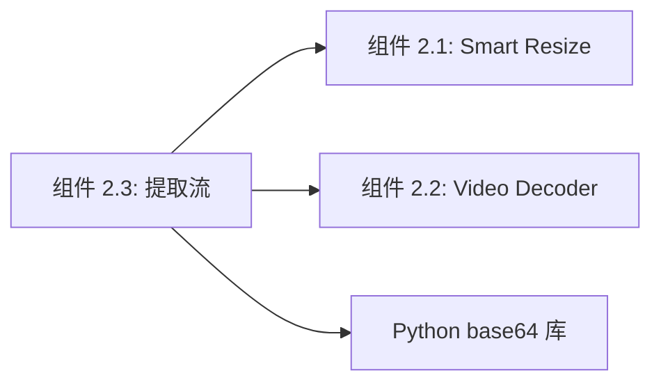

# 组件深度解析：多模态提取流 (Vision Info Extractor)

## 1. 组件概述

在 Qwen3-VL 的实际工程应用中，用户输入通常是一个嵌套的 `messages` 列表（遵循 OpenAI 规范）。`process_vision_info` 作为该组件的核心实现，承担了“多模态总线”的角色。其职责是深度扫描消息结构，识别出所有的图像与视频引用，并调用底层组件（2.1 和 2.2）完成物理处理，最终将异构输入汇聚为模型前向传播所需的规整张量。

### 核心价值
- **透明化模态转换**：开发者只需关注业务逻辑，无需处理 URL 下载、Base64 解码或 Tensor 转换。
- **元数据同步**：在提取像素的同时，同步生成 `image_grid_thw` 和 `video_grid_thw`，这是模型位置编码（MRoPE）的核心驱动力。

## 2. 架构位置图



## 3. 核心特性表格

| 特性 | 描述 | 技术实现 |
| :--- | :--- | :--- |
| **混合输入支持** | 同时支持本地路径、HTTP(S) URL 及 Base64。 | `requests` + `base64` 解码器。 |
| **THW 自动推演** | 根据处理后的 H, W 动态计算网格 THW。 | `get_grid_thw` 逻辑。 |
| **递归兼容性** | 允许视觉元素嵌套在消息的任意层级。 | 深度优先搜索算法。 |
| **Patch 大小适配** | 支持动态传入 patch_size 以兼容不同版本模型。 | `image_patch_size` 参数。 |

## 4. 文件与职责说明 [📄](file://qwen-vl-utils/src/qwen_vl_utils/vision_process.py#L480)

- **`vision_process.py`**:
    - `fetch_image`: 图像加载与格式标准化 (RGB)。
    - `fetch_video`: 视频加载与帧采样逻辑。
    - **`process_vision_info`**: 顶层递归函数，负责结果聚合。

## 5. 核心工作流：递归消息扫描



## 6. 公开接口详解

### `process_vision_info` [📄](file://qwen-vl-utils/src/qwen_vl_utils/vision_process.py#L480)
多模态信息提取的主入口。

- **函数签名**: `process_vision_info(messages, image_patch_size=14, ...)`
- **核心逻辑**：
    1. 初始化空的 `images` 和 `videos` 列表。
    2. 递归遍历 `messages` 寻找视觉载体。
    3. 对每个载体应用组件 2.1 的 `smart_resize`。
    4. 统计每一帧/图片的 patch 数量，构造 `thw` 描述。
- **返回结果**: `(List[PIL.Image], List[torch.Tensor], Dict)`

## 7. 类型定义：THW 结构

| 维度 | 含义 | 计算公式 (Qwen3-VL) |
| :--- | :--- | :--- |
| **T** (Temporal) | 时间切片数。 | 图像 $T=1$ (模型内部扩充为2) |
| **H** (Height) | 垂直补丁数。 | $H_{resized} / 16$ |
| **W** (Width) | 水平补丁数。 | $W_{resized} / 16$ |

## 8. 快速开始 (完整链路调用)

```python
from qwen_vl_utils import process_vision_info

messages = [
    {"role": "user", "content": [
        {"type": "image", "image": "http://img.png"},
        {"type": "text", "text": "图中内容"}
    ]}
]

# Qwen3-VL 必须明确指定 image_patch_size=16
images, videos, kwargs = process_vision_info(
    messages, 
    image_patch_size=16,
    return_video_kwargs=True
)

# kwargs 包含了模型必需的 image_grid_thw
print(kwargs['image_grid_thw'])
```

## 9. 常见用例

### 用例 1：多图对话提取
当 `messages` 包含 5 张图片时，组件会输出一个长度为 5 的 PIL 图像列表，并生成一个 `(5, 3)` 形状的 `image_grid_thw`。

### 用例 2：Base64 穿透
直接处理前端上传的图像：
```python
{"type": "image", "image": "data:image/jpeg;base64,/9j/4AAQ..."}
```

### 用例 3：动态参数覆盖
在消息中直接控制特定图片的质量：
```python
{"type": "image", "image": "detail.jpg", "max_pixels": 2048*28*28}
```

## 10. 最佳实践

- **返回元数据**：在接入 Transformers 时，务必设置 `return_video_kwargs=True`，否则视频的时间戳对齐将因缺少 metadata 而失效。
- **线程安全**：`fetch_image` 涉及网络请求，在处理大规模数据集时建议在外部包裹进程池。

## 11. 设计决策：为何选择“三元组”返回格式？

- **现状**：早期框架直接返回单个张量。
- **Qwen3-VL 决策**：返回 (图像列表, 视频张量列表, 元数据字典)。
- **原因**：图像和视频在模型内部的处理路径不同。图像进入 `processor.image_processor`，视频进入 `processor.video_processor`。分离返回确保了与官方 `AutoProcessor` 的完美对接。

## 12. 内部实现原理：THW 对齐逻辑 [📄](file://qwen-vl-utils/src/qwen_vl_utils/vision_process.py#L510)

```python
# 内部计算 grid_thw 的精要
def get_grid_thw(h, w, t, patch_size):
    # 注意：这里的 H 和 W 已经经过了 smart_resize
    return [t, h // patch_size, w // patch_size]
```
这里的 `patch_size` 决定了逻辑网格的粒度。对于 Qwen3-VL，尽管物理补丁是 $16 	imes 16$，但由于后续有 $2 	imes 2$ merge，逻辑上的 grid 坐标步进实际上是按照物理补丁来计算的，Merge 后的对齐由模型层处理。

## 13. 错误处理

- **Missing Content Error**：消息字典中缺少 `content` 键。
- **Invalid URL**：网络请求超时。建议设置 `timeout` 或使用本地缓存。

## 14. 依赖关系图



## 15. 相关文档链接

- [模块总览：视觉预处理总览](./vision_utils_module_overview.md)
- [AI 系统组件：融合机制](../AI系统/组件_融合机制.md)

## 16. 变更历史

- **v0.0.14**: 加入 `return_video_metadata` 开关，支持输出 (video_tensor, video_metadata) 元组。

---
*由 [Mini-Wiki v3.0.6](https://github.com/trsoliu/mini-wiki) 自动生成 | 2026-03-01*
