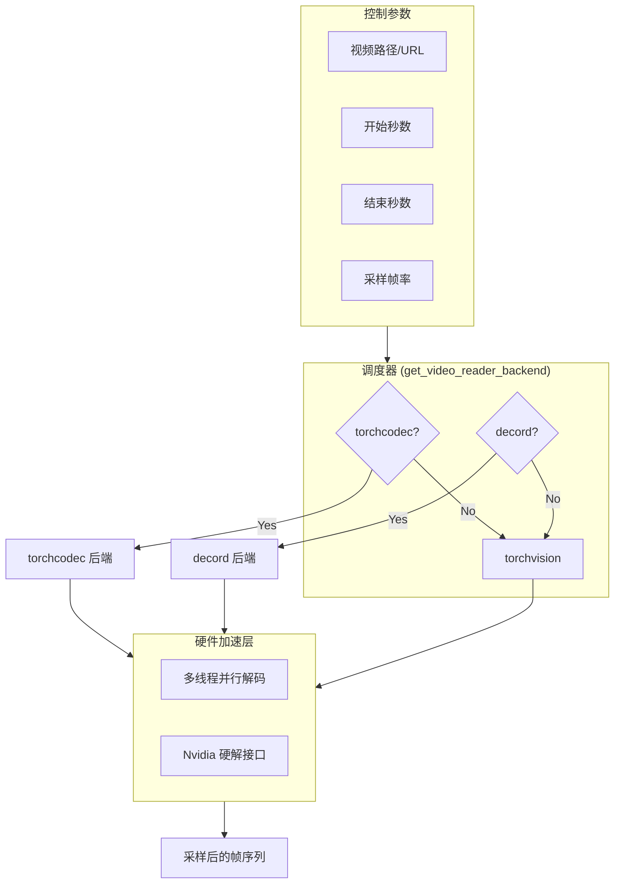
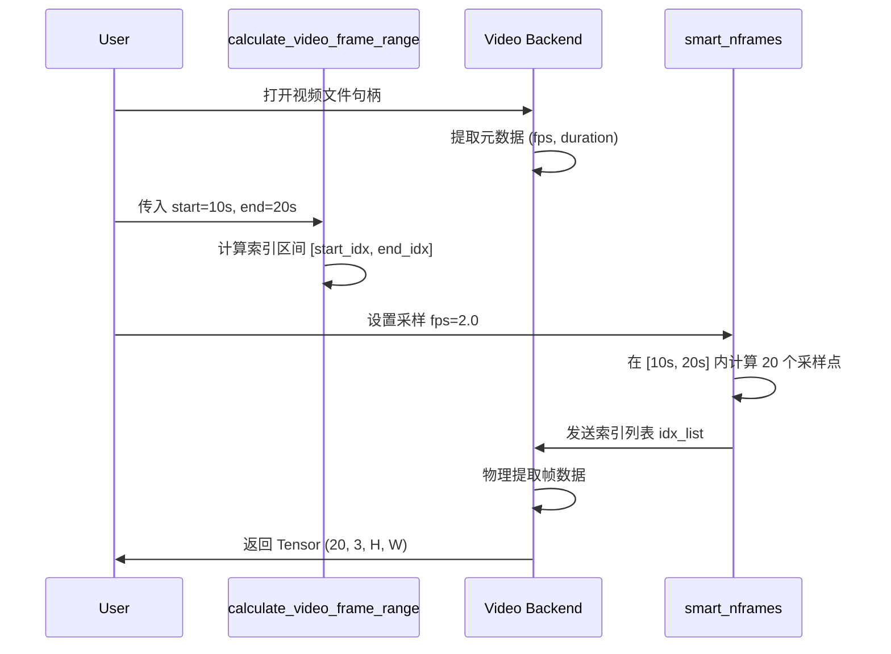
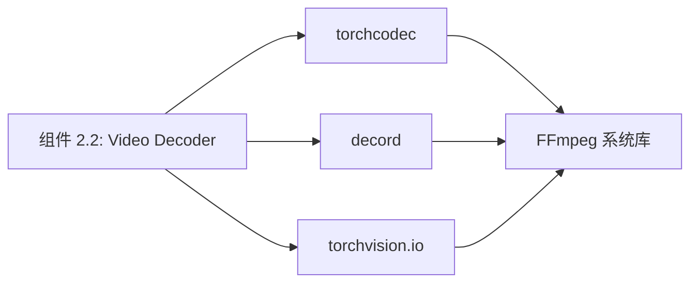

# 组件深度解析：视频解码引擎 (Video Decoders)

## 1. 组件概述

Qwen3-VL 对长视频的高性能理解建立在强大的视频解码基础设施之上。视频解码引擎组件承担着从压缩视频流（如 H.264/H.265）中精确提取特定时间戳像素帧的任务。

该组件通过一个抽象的后端调度器，动态适配 `torchcodec`, `decord`, 和 `torchvision` 三种主流 C++ 解码库。其设计目标是屏蔽底层 FFmpeg 的复杂性，为模型提供具备时间戳一致性的 TCHW 张量序列。

### 核心价值
- **随机访问加速**：针对长达数小时的视频，利用 `torchcodec` 的索引技术实现毫秒级的帧跳转。
- **时间精度控制**：支持按秒 (`pts`) 裁剪，确保模型处理的每一帧都与文本中的时间标签精准对齐。

## 2. 架构位置图



## 3. 核心特性表格

| 特性 | 描述 | 技术实现 |
| :--- | :--- | :--- |
| **多线程解码** | 支持配置 ffmpeg 解码线程数以榨取 CPU 性能。 | `TORCHCODEC_NUM_THREADS` |
| **动态采样 (FPS)** | 根据视频原始 FPS 动态计算采样索引。 | `smart_nframes` 函数。 |
| **异常防护** | 自动校验 `video_start >= video_end` 等边界逻辑。 | `calculate_video_frame_range` |
| **HTTPS 穿透** | 通过后端直接读取云端视频流，无需完整下载。 | 后端原生 URL 支持。 |

## 4. 文件与职责说明 [📄](file://qwen-vl-utils/src/qwen_vl_utils/vision_process.py#L201)

- **`vision_process.py`**:
    - `_read_video_torchcodec`: 基于 PyTorch 官方最新解码器的实现。
    - `_read_video_decord`: 基于经典高性能解码库的实现。
    - `calculate_video_frame_range`: 时间戳到帧索引的核心转换器。

## 5. 核心流程：时间序列提取算法



## 6. 公开接口详解

### `calculate_video_frame_range` [📄](file://qwen-vl-utils/src/qwen_vl_utils/vision_process.py#L235)
将用户的秒级输入转化为物理帧索引。

- **逻辑细节**：利用 `math.ceil` 处理起始帧，`math.floor` 处理结束帧，确保裁剪区间不越界。
- **参数说明**：
    - `ele`: 包含控制参数的字典。
    - `total_frames`: 视频流总物理帧。
- **返回值**: `(start_frame, end_frame, frame_count)`

## 7. 类型定义：解码元数据 (video_metadata)

| 字段名 | 类型 | 说明 |
| :--- | :--- | :--- |
| `fps` | `float` | 视频原始帧率。 |
| `frames_indices` | `List[int]` | 本次实际采样的物理帧索引。 |
| `video_backend` | `str` | 本次使用的解码器名称。 |

## 8. 快速开始 (后端强制切换)

如果您发现默认后端解析某些视频格式（如 MKV）有问题，可以手动切换：
```python
import os
# 强制使用 torchvision 后端（虽然慢，但兼容性最广）
os.environ["FORCE_QWENVL_VIDEO_READER"] = "torchvision"

from qwen_vl_utils import process_vision_info
# 后续调用将自动应用该环境变量
```

## 9. 常见用例

### 用例 1：精确秒级截取
场景：视频长 1 小时，只需分析 00:05:00 到 00:05:30。
```python
{"type": "video", "video": "long.mp4", "video_start": 300.0, "video_end": 330.0}
```

### 用例 2：低采样率监控
场景：监控视频，每 5 秒看一帧。
```python
{"type": "video", "video": "cam.mp4", "fps": 0.2}
```

### 用例 3：多线程并发加速
在 128 核服务器上，通过设置环境变量 `TORCHCODEC_NUM_THREADS=16`，可以显著提升 `torchcodec` 的批量帧提取速度。

## 10. 最佳实践

- **后端选择**：**强烈推荐 torchcodec**。它是 PyTorch 官方维护的最新解码库，支持多线程且与 Tensor 的零拷贝集成最好。
- **FPS 动态调整**：对于动作剧烈的视频（如体育比赛），建议将 `fps` 设为 2.0 以上；对于静态文档翻页，设为 0.5 即可。

## 11. 设计决策：为什么引入 `smart_nframes`?

- **问题**：如果简单按照 `fps * duration` 计算帧数，在非标准帧率视频下会出现 $1$ 帧的误差，导致模型的时间戳对齐失效。
- **决策**：`smart_nframes` 引入了 `FRAME_FACTOR=2` 的倍数约束（Qwen3-VL 3D 卷积核要求），确保抽出的总帧数永远是偶数且符合模型补丁化逻辑。

## 12. 内部实现原理：索引插值 [📄](file://qwen-vl-utils/src/qwen_vl_utils/vision_process.py#L225)

```python
# 核心采样公式
idx = torch.linspace(start_frame, end_frame, nframes).round().long()
```
该组件不使用简单的步长跳跃，而是使用 `linspace`。
- **收益**：当采样数不是物理帧的整数倍时（如在 10 帧里采 3 帧），`linspace` 能保证采样点在时间轴上分布最均匀，极大地平滑了视频理解的抖动。

## 13. 错误处理

- **ValueError: Invalid time range**：起始时间大于结束时间。
- **Torchcodec Indexing Error**：视频索引损坏。建议尝试修复视频文件或切换后端。

## 14. 依赖关系图



## 15. 相关文档链接

- [模块总览：视觉预处理总览](./vision_utils_module_overview.md)
- [组件 2.1：几何缩放算法](./组件_几何缩放.md)

## 16. 变更历史

- **v0.0.14**: 加入 `calculate_video_frame_range` 时间范围校验逻辑。
- **v0.0.14**: `torchcodec` 成为首选默认后端。

---
*由 [Mini-Wiki v3.0.6](https://github.com/trsoliu/mini-wiki) 自动生成 | 2026-03-01*
