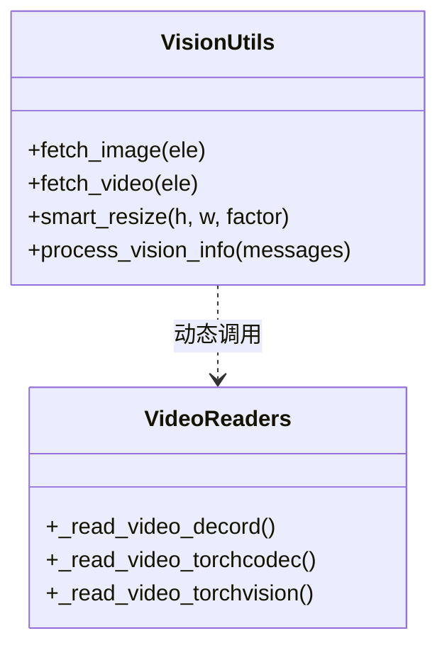
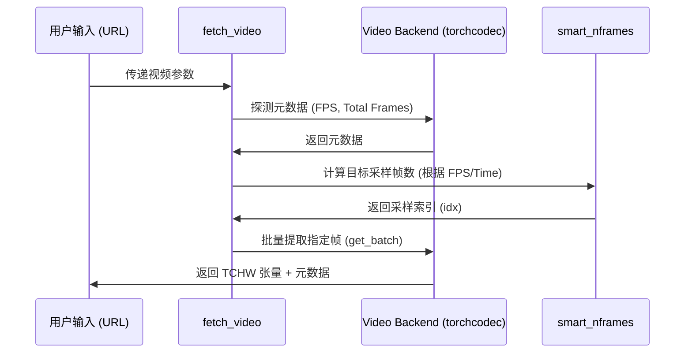

# 视觉处理领域：Qwen-VL 预处理工具 (qwen-vl-utils)

## 1. 模块概述

`qwen-vl-utils` 是 Qwen-VL 系列模型的核心视觉基础设施。它承担了从原始多模态输入（本地路径、URL、Base64）到模型可理解的高维张量（TCHW）的转换任务。该模块通过高度优化的 `smart_resize` 算法和多后端视频解码技术，确保了在不同分辨率和帧率下，视觉信息的无损传递与计算资源的高效利用。

### 1.1 核心价值
- **几何一致性**: 保持图像原始宽高比，通过因子整除算法避免插值带来的语义失真。
- **高吞吐解码**: 自动选择 `torchcodec`、`decord` 或 `torchvision` 后端，实现秒级长视频解析。
- **内存安全控制**: 提供像素级预算控制 (`pixel_control`)，防止在 24K 以上高分辨率场景下发生显存溢出。

### 1.2 架构位置


## 2. 核心功能与特性

### 2.1 功能矩阵
| 特性 | 描述 | 技术实现 |
| :--- | :--- | :--- |
| **Smart Resize** | 自动计算满足 Patch 整除的最优分辨率。 | `smart_resize` 函数。 |
| **多后端解码** | 动态适配最快视频解码库。 | `VIDEO_READER_BACKENDS` 调度。 |
| **时间切片提取** | 支持视频起止时间 (`video_start/end`) 裁剪。 | `calculate_video_frame_range`。 |
| **像素预算控制** | 允许用户自定义 `max_pixels` 限制 Token 数。 | 全局变量 + `ele` 级别参数覆盖。 |

### 2.2 核心类与函数图



## 3. 目录结构与职责 [📄](file://qwen-vl-utils/README.md)

| 路径 | 职责 | 备注 |
| :--- | :--- | :--- |
| `src/qwen_vl_utils/` | 核心源代码。 | - |
| `├── __init__.py` | 导出公共接口。 | `process_vision_info` 等。 |
| `└── vision_process.py` | 图像/视频处理逻辑实现。 | 包含所有 Resize 和读取逻辑。 |
| `pyproject.toml` | 依赖与构建配置。 | 包含 `decord` 可选依赖定义。 |

## 4. 核心工作流：视频解码与采样 [📄](file://qwen-vl-utils/src/qwen_vl_utils/vision_process.py#L201)



## 5. 视频读取后端对比

| 后端 | 优势 | 劣势 | 推荐场景 |
| :--- | :--- | :--- | :--- |
| **torchcodec** | 最快速度、支持多线程、原生 Torch 集成。 | 需手动安装、较新。 | **生产环境、H100/A100。** |
| **decord** | 性能优异、API 简洁。 | 已停止维护、安装较复杂。 | 旧版本兼容。 |
| **torchvision** | 无需额外安装、兼容性最强。 | 解码 HTTPS 视频较慢。 | 开发调试。 |

> **配置建议**: 设置环境变量 `FORCE_QWENVL_VIDEO_READER=torchcodec` 以获得最高性能。

## 6. 公共 API 详细参考

### 6.1 `process_vision_info`
主入口函数，用于处理消息列表中的所有视觉元素。

```python
def process_vision_info(
    messages: List[Dict[str, Any]],
    image_patch_size: int = 14,
    return_video_kwargs: bool = False,
    return_video_metadata: bool = False,
) -> Tuple[Optional[List[Image.Image]], Optional[List[torch.Tensor]], Dict[str, Any]]
```

| 参数 | 类型 | 说明 |
| :--- | :--- | :--- |
| `image_patch_size` | `int` | Qwen3-VL 设为 16，Qwen2.5 设为 14。 |
| `return_video_metadata` | `bool` | 若为 True，视频结果将包含 `(video_tensor, metadata)` 元组。 |

### 6.2 `smart_resize` [📄](file://qwen-vl-utils/src/qwen_vl_utils/vision_process.py#L65)
核心几何缩放函数。

**算法逻辑**:
1. 计算目标总像素范围 $[min\_pixels, max\_pixels]$。
2. 在保持宽高比的前提下，寻找最接近的、能被 `factor`（通常为 32）整除的尺寸。
3. 若超出范围，则等比例缩放至边界。

---
*(待续：下一部分将包含类型定义、代码示例、性能优化、错误处理及源码追溯等章节)*
