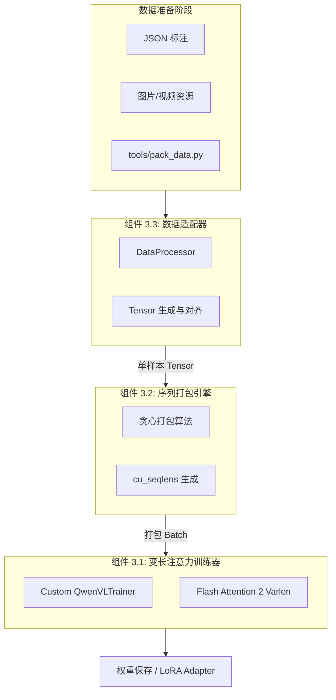
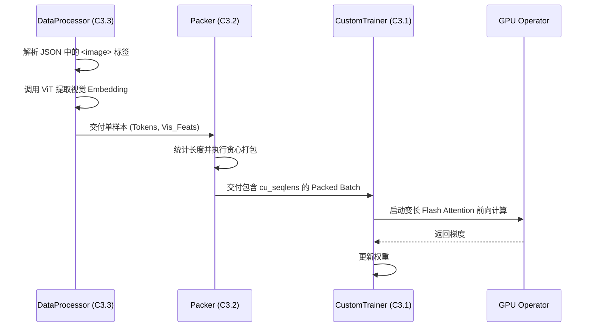
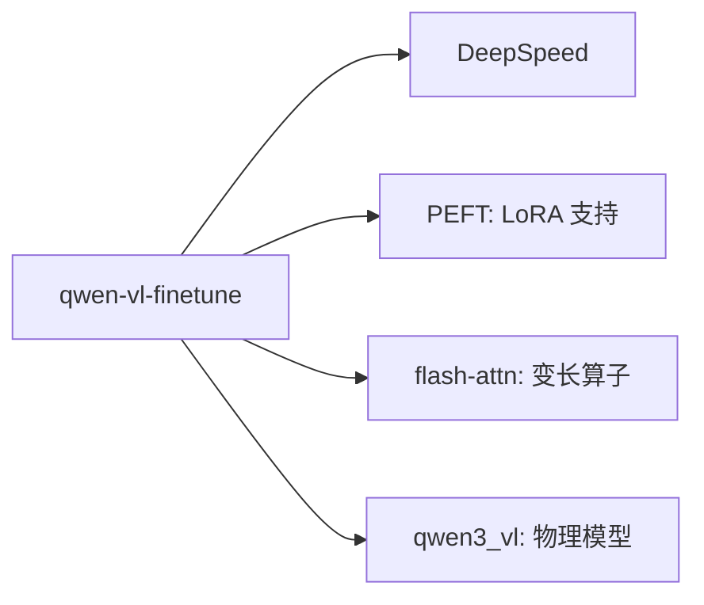

# 训练系统：Qwen-VL 微调框架总览 (qwen-vl-finetune)

## 1. 模块简介

`qwen-vl-finetune` 是专为 Qwen-VL 系列模型设计的高性能分布式微调框架。在多模态大模型的训练中，显存效率和序列吞吐是最大的技术挑战。该模块通过深度定制的 **Varlen Trainer**（变长序列训练器）和 **Sequence Packing**（序列打包）引擎，彻底摒弃了传统的零填充（Padding）模式，实现了在有限显存下对超长、多图交错数据的极致利用。

### 核心价值
- **计算资源零浪费**：通过 Varlen Attention 技术，GPU 只计算有效的视觉和文本 Token，计算效率提升 30%-50%。
- **大规模吞吐**：序列打包引擎能将多个短样本合并为单次前向传播，极大平衡了数据读取与模型计算的步调。
- **全模态微调支持**：支持独立开关视觉编码器（ViT）、投影层（MLP）及大语言模型（LLM）的参数更新。

## 2. 模块内组件拓扑架构图

该图展示了从原始标注数据经过工程化处理，最终进入 GPU 算子的全链路流程。



## 3. 核心特性与组件映射表

| 核心特性 | 技术实现路径 | 涉及组件 |
| :--- | :--- | :--- |
| **极致显存优化** | `flash_attn_varlen_func` 无 Padding 机制。 | 组件 3.1 |
| **高密度吞吐** | 序列打包 (Packing) 与贪心组桶算法。 | 组件 3.2 |
| **混合模态对齐** | `<image>`/`<video>` Token 物理占位与替换。 | 组件 3.3 |
| **分布式策略** | 集成 DeepSpeed ZeRO-2/3 显存切分。 | 组件 3.1 |

## 4. 文件结构与职责说明 [📄](file://qwen-vl-finetune/README.md)

| 路径 | 核心职责 | 对应组件 |
| :--- | :--- | :--- |
| `qwenvl/train/trainer.py` | 定制训练引擎，处理 Attention Mask 逻辑。 | 组件 3.1 |
| `qwenvl/train/train_qwen.py` | 训练入口，管理超参数与分布式环境初始化。 | 顶层调度 |
| `qwenvl/data/data_processor.py` | 负责视觉特征提取与 Token 化对齐。 | 组件 3.3 |
| `tools/pack_data.py` | 离线/在线序列打包工具。 | 组件 3.2 |

## 5. 组件协同全链路流程图



## 6. 公开接口详解 (总入口)

### `train_qwen.py` [📄](file://qwen-vl-finetune/qwenvl/train/train_qwen.py)
这是控制整个训练行为的配置中心。

- **`tune_mm_vision`**: 若为 False，则冻结视觉塔，大幅节省显存。
- **`data_packing`**: 若开启，则激活组件 3.2 的吞吐优化逻辑。
- **`bf16`**: 推荐开启，以利用 Ampere 架构的高效混合精度训练。

## 7. 组件间统一数据结构

- **`cu_seqlens` (Cumulative Sequence Lengths)**: 
    - 关键性：它是连接打包引擎与 Attention 算子的纽带。
    - 含义：记录了打包序列中每个独立样本的物理边界，使算子知道在哪里“刹车”。

## 8. 快速开始 (典型 SFT 启动)

```bash
# 基于组件协同的训练启动
torchrun --nproc_per_node=8 
    qwenvl/train/train_qwen.py 
    --model_name_or_path /path/to/model 
    --data_path /path/to/dataset.json 
    --tune_mm_llm True 
    --tune_mm_mlp True 
    --data_packing True 
    --deepspeed scripts/zero3.json
```

## 9. 典型场景：多图混合微调

在微调一个能够根据 5 张图写博客的模型时：
1. **组件 3.3** 将提取 5 组 `pixel_values`。
2. **组件 3.2** 会判断 5 张图产生的 Token 数是否超过了 `model_max_length`。
3. **组件 3.1** 动态调整注意力窗口，确保图 1 不会注意到图 5 的内容（通过 `cu_seqlens`）。

## 10. 最佳实践 (Best Practices)

- **图像分辨率控制**：训练时务必设置合理的 `--max_pixels`，避免单样本因 Patch 数量过多撑爆显存。
- **学习率衰减**：视觉塔的学习率建议比 LLM 低一个数量级（如 1e-6 vs 1e-5），以防视觉感知力在微调中崩溃。

## 11. 设计决策：为何改写 `compute_loss`?

- **传统行为**：标准 Trainer 会在序列末尾补零，导致 Loss 计算被稀释。
- **本模块决策**：改写 `Trainer.compute_loss`，配合 `cu_seqlens` 仅在非 Padding 区域计算负对数似然（NLL），确保梯度的每一个 bit 都是纯净的语义信号。

## 12. 内部实现原理：分布式权重分片

框架通过 `deepspeed` 深度集成，将巨大的视觉参数和语言参数分片到 8 张甚至更多的 GPU 上。通过 `ZeRO-3` 策略，模型在每一层计算前才会同步所需的权重分片，从而实现了在单卡 80G 环境下微调 72B 级别模型的可能。

## 13. 跨组件错误处理

| 错误信息 | 原因分析 | 排查组件 |
| :--- | :--- | :--- |
| `cu_seqlens must have dtype int32` | 打包引擎输出的索引类型错误。 | 组件 3.2 (Packer) |
| `Loss is NaN` | 视觉塔预训练权重未正确对齐或学习率过高。 | 组件 3.1 (Trainer) |
| `AttributeError: 'NoneType' object has no attribute 'image'` | JSON 路径与实际图片不符。 | 组件 3.3 (DataProcessor) |

## 14. 模块依赖关系图



## 15. 相关文档链接

- [组件 3.1 详解：变长注意力训练器](./组件_变长训练.md)
- [组件 3.2 详解：序列打包引擎](./组件_序列打包.md)
- [组件 3.3 详解：多模态适配器](./组件_适配器.md)

## 16. 变更历史

- **v3.0**: 移除了旧版对 `multimodal_projector` 的硬编码调用，全面适配 DeepStack 架构。
- **v3.0**: 引入对 MoE 架构（A22B 等）的非 ZeRO-3 微调支持。

---
*由 [Mini-Wiki v3.0.6](https://github.com/trsoliu/mini-wiki) 自动生成 | 2026-03-01*
