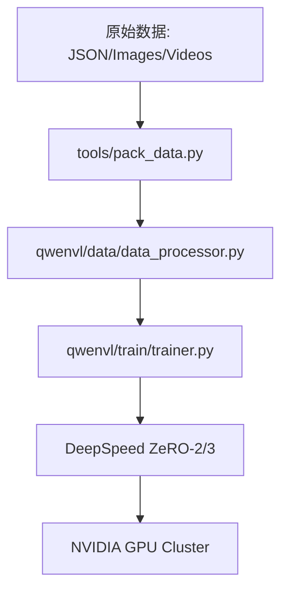
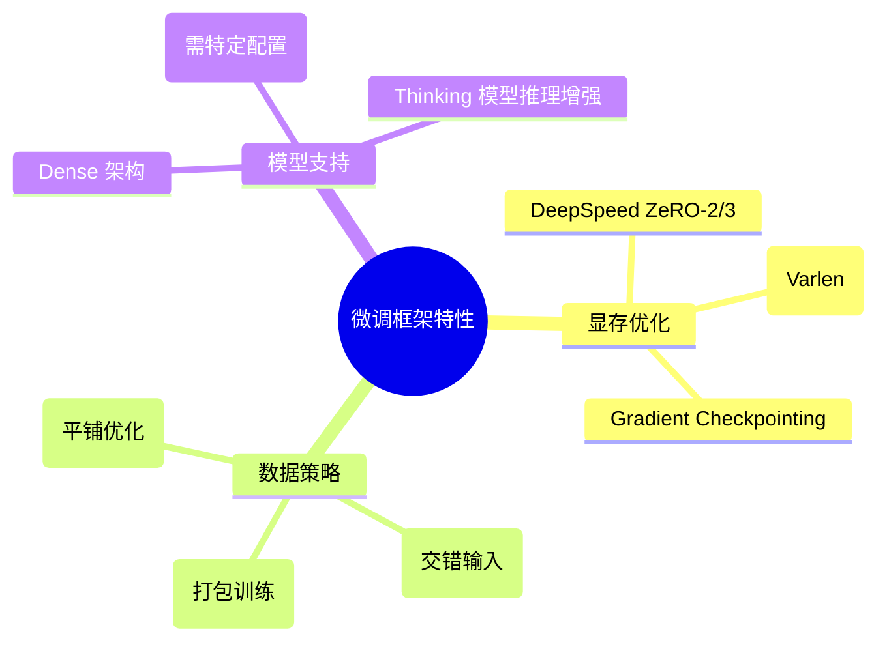
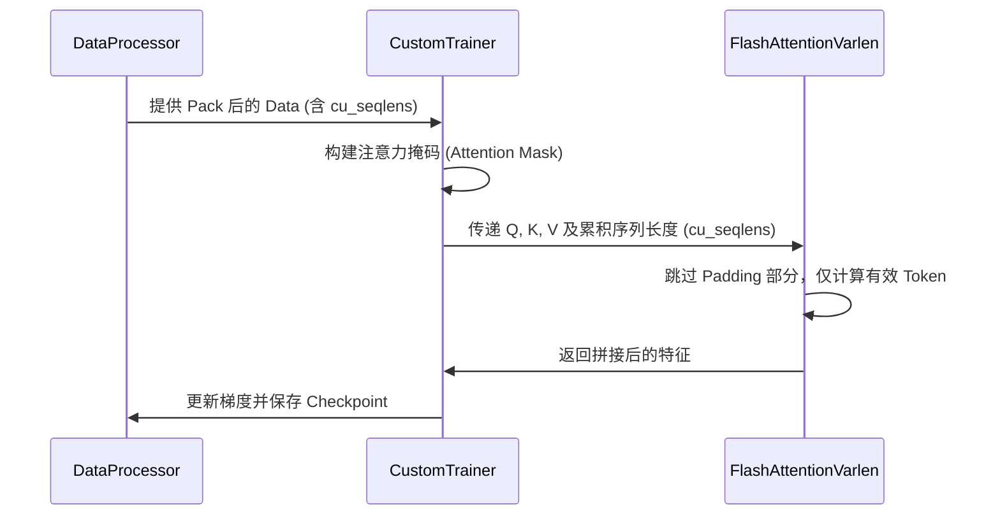

# 训练系统：Qwen-VL 微调框架 (qwen-vl-finetune)

## 1. 模块概述

`qwen-vl-finetune` 是一个工业级的高性能多模态训练框架。它针对 Qwen3-VL 及其前代模型（Qwen2, Qwen2.5）进行了深度优化，集成了 DeepSpeed ZeRO 策略、Flash Attention 2 变长序列处理以及高效的 LoRA 参数微调技术。该框架旨在支持从单卡实验室环境到大规模 GPU 集群的生产级微调任务。

### 1.1 核心价值
- **全栈微调能力**: 支持独立控制语言模型（LLM）、视觉塔（Vision Tower）和投影层（MLP）的权重更新。
- **极致显存优化**: 通过变长 Flash Attention 和序列打包 (Packing) 技术，显著提升长序列训练的吞吐量并降低显存碎片的产生。
- **高保真数据预处理**: 内置多模态混合采样与 Grounding 数据格式转换工具，确保模型在下游任务上的对齐精度。

### 1.2 架构位置



## 2. 核心功能与特性

### 2.1 训练模式矩阵
| 模式 | 描述 | 适用场景 |
| :--- | :--- | :--- |
| **Full SFT** | 全参数微调，更新所有模块。 | 基础能力大幅迁移、垂直领域适配。 |
| **LoRA** | 低秩自适应微调，仅更新旁路参数。 | 算力受限、多任务并行部署。 |
| **Vision-Frozen** | 冻结视觉塔，仅训练 LLM 和投影层。 | **推荐模式**，保持视觉通用感知力。 |
| **Stage-wise** | 分阶段训练，先对齐投影层再微调全局。 | 新模态引入、极致对齐。 |

### 2.2 核心特性图



## 3. 目录结构与职责 [📄](file://qwen-vl-finetune/README.md)

| 路径 | 职责 | 备注 |
| :--- | :--- | :--- |
| `qwenvl/train/` | 训练引擎核心实现。 | - |
| `├── trainer.py` | 自定义 Trainer，处理变长 Attention。 | [📄](file://qwen-vl-finetune/qwenvl/train/trainer.py) |
| `└── train_qwen.py` | 训练启动入口脚本。 | [📄](file://qwen-vl-finetune/qwenvl/train/train_qwen.py) |
| `qwenvl/data/` | 数据处理与增强。 | - |
| `├── data_processor.py` | 多模态输入 Tensor 转换。 | - |
| `└── rope2d.py` | 2D 旋转位置嵌入实现。 | - |
| `scripts/` | 标准化训练脚本 (Bash)。 | 包含 Zero2/3 配置。 |
| `tools/` | 数据预处理与验证工具。 | `check_image.py` 等。 |

## 4. 核心工作流：变长 Flash Attention 训练 [📄](file://qwen-vl-finetune/qwenvl/train/trainer.py#L30)

在多模态微调中，不同样本的 Token 长度差异极大。传统 Padding 方式会导致严重的计算浪费和显存碎片。



## 5. 核心算法详解：序列打包 (Packing) [📄](file://qwen-vl-finetune/tools/pack_data.py)

为了极致利用 `model_max_length`，框架支持将多个短样本（如单张图问答）打包进同一个训练 Batch 中。

**打包规则**:
1. 计算每个样本的 Token 总数（包含视觉补丁）。
2. 使用贪心算法将样本放入容量为 `max_length` 的“桶”中。
3. 在样本间插入 `<|im_end|>` 等分隔符。
4. 在训练时通过 `cu_seqlens` 告知 Flash Attention 每个样本的物理边界。

---

## 6. 公共 API 详细参考

### 6.1 `train_qwen.py` 核心参数

| 参数名 | 默认值 | 说明 |
| :--- | :--- | :--- |
| `--tune_mm_llm` | `True` | 是否微调语言模型（建议开启）。 |
| `--tune_mm_vision` | `False` | 是否微调视觉塔（视频训练建议保持 False）。 |
| `--tune_mm_mlp` | `True` | 是否微调投影层（必须开启）。 |
| `--data_packing` | `False` | 是否开启数据打包（显著提升吞吐）。 |
| `--max_pixels` | `576*28*28` | 训练时的图像最大分辨率。 |

### 6.2 自定义 `Trainer` [📄](file://qwen-vl-finetune/qwenvl/train/trainer.py)

```python
class QwenVLTrainer(Trainer):
    def compute_loss(self, model, inputs, return_outputs=False):
        # 实现了对变长 Attention 的深度适配
        # 处理多模态输入的掩码与梯度回传
        ...
```

---
*(待续：下一部分将包含训练参数表、代码示例、性能优化、错误处理及源码追溯等章节)*
