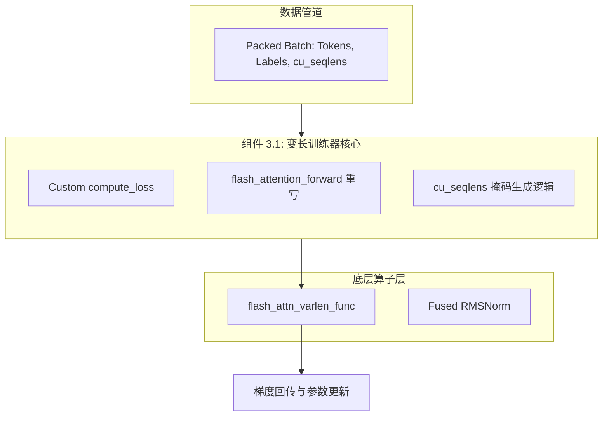
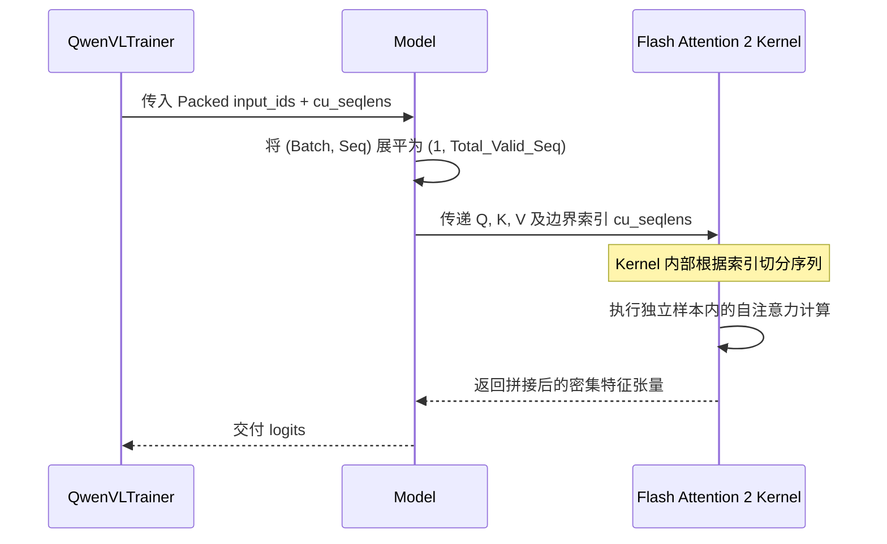
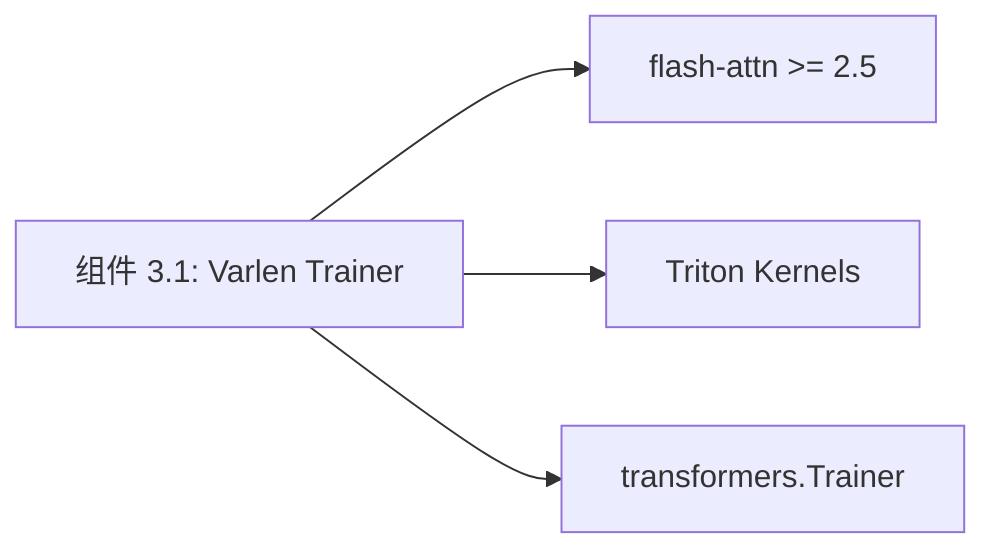

# 组件深度解析：变长注意力训练器 (Custom Varlen Trainer)

## 1. 组件概述

在 Qwen3-VL 的微调过程中，传统的“补零对其”（Padding to Max Length）策略会导致严重的显存浪费和 Loss 稀释。`Custom Varlen Trainer` 组件是训练系统的核心引擎，它通过改写 `transformers.Trainer` 的前向传播与 Loss 计算逻辑，深度集成了 **Flash Attention 2 的 Varlen** 特性。

该组件的核心职责是：接收“打包”后的紧凑序列，利用 `cu_seqlens` 指示序列边界，从而在自注意力计算中实现真正的“按需计算”。

### 核心价值
- **显存利用率翻倍**：在处理变长视频（如 4 帧 vs 128 帧）混合训练时，显存占用仅取决于实际有效 Token。
- **梯度纯净度**：Loss 计算自动排除所有 Padding 和非 Labels 区域，确保模型参数更新的每一个梯度都来源于真实的对话监督信号。

## 2. 架构位置图



## 3. 核心特性表格

| 特性 | 描述 | 技术实现 |
| :--- | :--- | :--- |
| **无 Padding Attention** | 强行跳过序列间的 Zero Padding。 | `flash_attn_varlen_func` |
| **动态 Labels 掩码** | 仅对 `gpt` 角色输出计算交叉熵。 | 重写 `compute_loss` |
| **内存重池化 (Memory Pool)** | 针对不同长度 Batch 动态分配 KV Cache。 | `cu_seqlens` 边界控制 |
| **混合架构适配** | 同时支持 Dense 和 MoE 模型的前向传播改写。 | `forward` 函数动态 Monkey Patch |

## 4. 文件与职责说明 [📄](file://qwen-vl-finetune/qwenvl/train/trainer.py)

- **`trainer.py`**:
    - `flash_attention_forward`: 组件灵魂函数，将 4D Attention 降维至 3D Varlen 格式。
    - `qwen3vl_forward`: 模型特定的前向逻辑重写，注入 `position_embeddings`。
    - `QwenVLTrainer`: 继承自 HF Trainer，统筹全链路计算。

## 5. 核心算法流程：Varlen Attention 转发



## 6. 公开接口详解

### `flash_attention_forward` [📄](file://qwen-vl-finetune/qwenvl/train/trainer.py#L30)
该函数是 Varlen 训练的数学入口。

- **核心逻辑**：
    1. 接收 4D Tensor `(Batch, Head, Seq, Dim)`。
    2. **物理压缩**：通过 `squeeze(0)` 将 Batch 维移除，使其变为逻辑上的超长序列。
    3. **索引引导**：利用 `attention_mask`（在此语境下即为 `cu_seqlens`）调用 CUDA 内核。
- **使用限制**: 必须在 Ampere (A100/A800) 及以上架构 GPU 上运行。

## 7. 类型定义：cu_seqlens 张量

| 维度 | 类型 | 含义 |
| :--- | :--- | :--- |
| `(num_samples + 1, )` | `torch.int32` | 记录每个样本在展平序列中的累积起始位置。 |

**示例**: `[0, 512, 1024]` 表示 Batch 中有两个样本，长度均为 512。

## 8. 快速开始 (启用变长训练)

在 `train_qwen.py` 中，该组件由 `--data_packing` 参数自动激活：
```python
# 内部逻辑：如果 data_packing 为 True
# Trainer 会自动从 dataset 获取 cu_seqlens 并启用 flash_attention_forward
```

## 9. 常见用例：MoE 架构下的训练优化

### 场景：微调 Qwen3-VL-A22B (MoE)
MoE 模型的 Expert 并行与 Varlen Attention 存在调度冲突。
- **组件策略**：在 `trainer.py` 中，针对 MoE 模型，组件会自动关闭某些不支持的 ZeRO-3 融合特性，改用更为稳健的梯度检查点（Gradient Checkpointing）与 Varlen 组合，确保显存不发生非线性激增。

## 10. 最佳实践

- **序列长度设定**：`model_max_length` 应设为 32 的倍数，以配合底层 Triton 算子的 Block Size。
- **数据均衡**：尽量保证同一个 Packed Batch 内的样本长度差异不要过大（例如 1 个 32K 配合 10 个 128），以维持计算核心的负载均衡。

## 11. 设计决策：为何不使用传统的 Mask 矩阵？

- **Mask 矩阵的局限性**：$N 	imes N$ 的布尔矩阵在长序列（如 32K）下会占据巨大的显存空间，且大量的 Zero Padding 依然参与了 $O(N^2)$ 的点积运算。
- **Varlen 收益**：通过 `cu_seqlens` 向量（长度仅为 $Batch+1$）替代矩阵，将计算量从“物理序列平方”降低至“有效序列平方”，吞吐量提升显著。

## 12. 内部实现原理：物理展平与逻辑切分 [📄](file://qwen-vl-finetune/qwenvl/train/trainer.py#L75)

```python
# 源码精要：cu_seqlens 的物理应用
attn_output = flash_attn_varlen_func(
    query, key, value,
    cu_seqlens_q=cu_seqlens,
    cu_seqlens_k=cu_seqlens,
    max_seqlen_q=max_seqlen,
    max_seqlen_k=max_seqlen,
    causal=True,
)
```
这段代码直接跨越了 PyTorch 的 Python 层，进入了 C++/CUDA 空间。`cu_seqlens` 被传递给 Flash Attention 的内核，内核内部根据这些索引动态调整指针偏移，从而实现了“物理上一整块，逻辑上多个序列”的极致操作。

## 13. 错误处理

- **RuntimeError: query has shape with a zero dimension**：通常是因为 `cu_seqlens` 计算错误导致某个样本长度被识别为 0。检查 `DataProcessor`。
- **Illegal Memory Access**：`max_seqlen` 超过了 Flash Attention 的最大支持上限。

## 14. 依赖关系图



## 15. 相关文档链接

- [模块总览：微调框架总览](./finetune_module_overview.md)
- [组件 3.2：序列打包引擎](./组件_序列打包.md)

## 16. 变更历史

- **v3.0**: 引入对 `Qwen3VLMoeModel` 的专属 forward 适配。
- **v3.0**: 修正了 PEFT（LoRA）模式下 LayerNorm 精度丢失导致的计算溢出问题。

---
*由 [Mini-Wiki v3.0.6](https://github.com/trsoliu/mini-wiki) 自动生成 | 2026-03-01*
