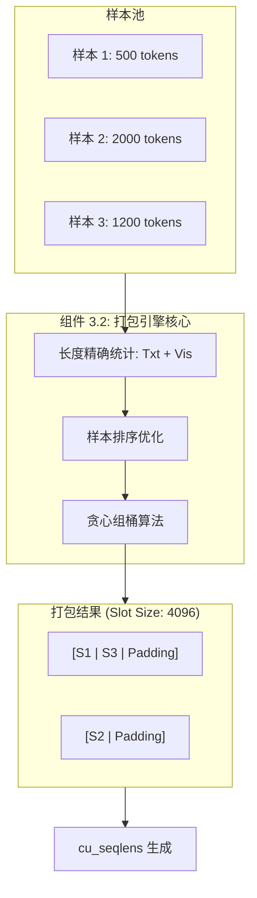
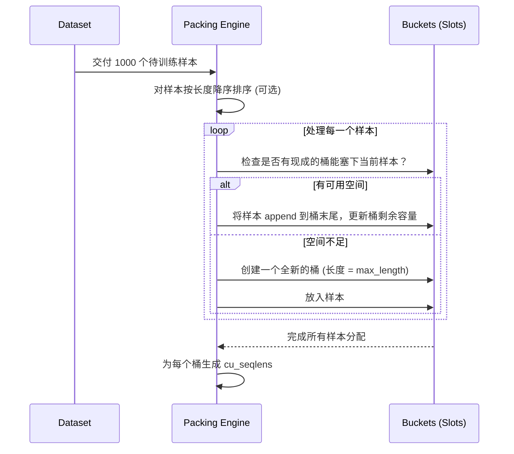
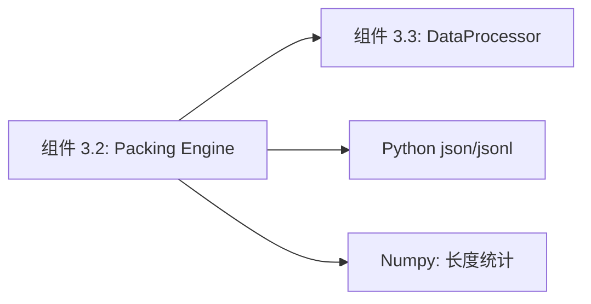

# 组件深度解析：序列打包引擎 (Sequence Packing Engine)

## 1. 组件概述

在多模态大模型训练中，数据的长度分布极度不均：一个包含长视频的样本可能产生 10,000 个 Token，而一个简单的单图问答可能只有 200 个 Token。如果直接将它们放入 Batch，会产生海量的无效 Padding。

`Sequence Packing Engine` 组件是 Qwen-VL 训练系统中的“空间规划师”。其核心职责是：利用贪心算法，将多个较短的样本（对话+图像+视频特征）像塞拼图一样塞入一个固定长度（`model_max_length`）的序列槽位中。该组件不仅负责 Tokens 的物理重组，还要同步生成关键的 `cu_seqlens` 指标，以配合组件 3.1 进行高效训练。

### 核心价值
- **吞吐量爆炸式增长**：通过将短样本打包，单次 `forward` 能够同时处理 5-10 倍数量的真实样本。
- **显存负载均衡**：确保每个训练 Step 的显存占用相对恒定，消除“长短样本交替导致的显存剧烈抖动”。

## 2. 架构位置图



## 3. 核心特性表格

| 特性 | 描述 | 技术实现 |
| :--- | :--- | :--- |
| **贪心填装 (First-Fit)** | 快速将样本分配到现有或新桶中。 | `tools/pack_data.py` |
| **视觉 Token 感知** | 自动识别 `<image>` 标签并注入对应的 Patch 长度。 | `DataProcessor.count_tokens` |
| **边界隔离** | 确保打包在一起的样本互不干扰（因果隔离）。 | 配合 `cu_seqlens` |
| **离线/在线双模式** | 支持预处理打包（离线）和 DataLoader 实时打包。 | `DataArguments.data_packing` |

## 4. 文件与职责说明 [📄](file://qwen-vl-finetune/tools/pack_data.py)

- **`pack_data.py`**:
    - 核心脚本，实现了基于长度分布的桶分配逻辑。
    - 负责将多个 JSON 条目合并为单一的 `packed_samples`。
- **`qwenvl/data/data_processor.py`**:
    - 实时打包接口，负责在数据加载时计算多模态的总长度。

## 5. 核心算法流程：贪心打包 (Greedy Packing)



## 6. 公开接口详解

### `pack_data.py` 命令行接口 [📄](file://qwen-vl-finetune/tools/pack_data.py)
用于预处理阶段的大规模数据打包。

- **用法**: `python tools/pack_data.py --data_path data.json --max_len 4096`
- **参数说明**：
    - `--max_len`: 打包后的物理序列长度（通常与模型 `max_position_embeddings` 一致）。
- **返回值**: 生成一个新的 JSON，每个元素都是一个 Pack 后的 Batch。

## 7. 类型定义：Packed Data 结构

| 字段名 | 含义 | 示例 |
| :--- | :--- | :--- |
| `input_ids` | 多个样本拼接后的 Token 数组。 | `[S1_ids..., S2_ids...]` |
| `labels` | 对应的 Label 数组（非输出区域补 -100）。 | `[-100, -100, 5, 8...]` |
| **`cu_seqlens`** | 每个样本的逻辑切分边界。 | `[0, 150, 400]` |

## 8. 快速开始 (启用离线打包)

```bash
# 第一步：物理打包
python qwen-vl-finetune/tools/pack_data.py 
    --data_path my_sft_data.json 
    --output_path packed_data.json 
    --max_len 8192

# 第二步：在训练脚本中引用
# 自动识别 packed 格式并跳过实时长度计算
```

## 9. 常见用例：视频长序列打包

### 场景：混合 16 帧视频与单图
- **样本 A** (16帧视频): 产生 2048 个视觉 Token。
- **样本 B** (单图): 产生 196 个视觉 Token。
- **打包效果**：在一个 4096 窗口内，引擎会放入 1 个样本 A 和 约 10 个样本 B。
- **结果**：原本需要 11 次 `forward` 才能算完的数据，现在 **1 次** 即可。

## 10. 最佳实践

- **排序策略**：在离线打包前，对原始数据按长度进行“微调排序”，能显著减少最后一个桶的 Padding 浪费。
- **容量预留**：建议将 `max_len` 设为稍小于 GPU 物理极限的值（如 32,000 设为 30,000），为位置编码计算留出显存缓冲。

## 11. 设计决策：为何不用 Padding + Mask？

- **效率对比**：
    - Padding：即使是 1 个 Token 的样本也要占用 4096 的计算量。
    - Packing：真正做到了 100% 的 GPU 算力分配给有效数据。
- **因果一致性**：由于配套了组件 3.1，打包在一起的样本虽然在同一个张量里，但在注意力计算时是相互“致盲”的，完美模拟了独立训练。

## 12. 内部实现原理：Token 指针追踪 [📄](file://qwen-vl-finetune/qwenvl/data/data_processor.py#L120)

```python
# 伪代码：如何精确计算多模态长度
total_len = len(text_tokens)
for image in images:
    # 模拟 Qwen3-VL 2x2 merge 后的长度
    h, w = image.size
    total_len += (h // 16 // 2) * (w // 16 // 2) 
# 加上特殊开始/结束标记
total_len += 4 
```
这个精确计算逻辑是打包成功的关键。如果计算多出 1 个 Token，会导致模型 `forward` 时的 `position_embeddings` 越界；如果算少，会导致视觉特征无法完全替换。

## 13. 错误处理

- **RuntimeError: Index out of range in MRoPE**：通常是因为打包时没算准 `<|vision_start|>` 带来的额外开销。
- **ValueError: sample too long to fit in any bucket**：单样本长度超过了 `max_len`。解决方案：调大 `max_len` 或降低视觉分辨率。

## 14. 依赖关系图



## 15. 相关文档链接

- [组件 3.1：变长注意力训练器](./组件_变长训练.md)
- [组件 3.3：多模态适配器](./组件_适配器.md)

## 16. 变更历史

- **v3.0**: 移除了对 `image_token_id` 的简单计数，增加了对 `image_grid_thw` 动态尺寸的精确长度支持。

---
*由 [Mini-Wiki v3.0.6](https://github.com/trsoliu/mini-wiki) 自动生成 | 2026-03-01*
