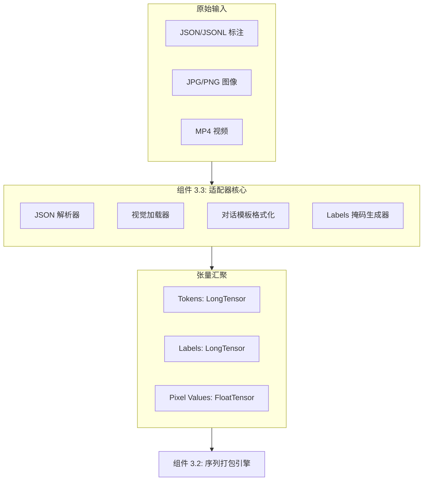
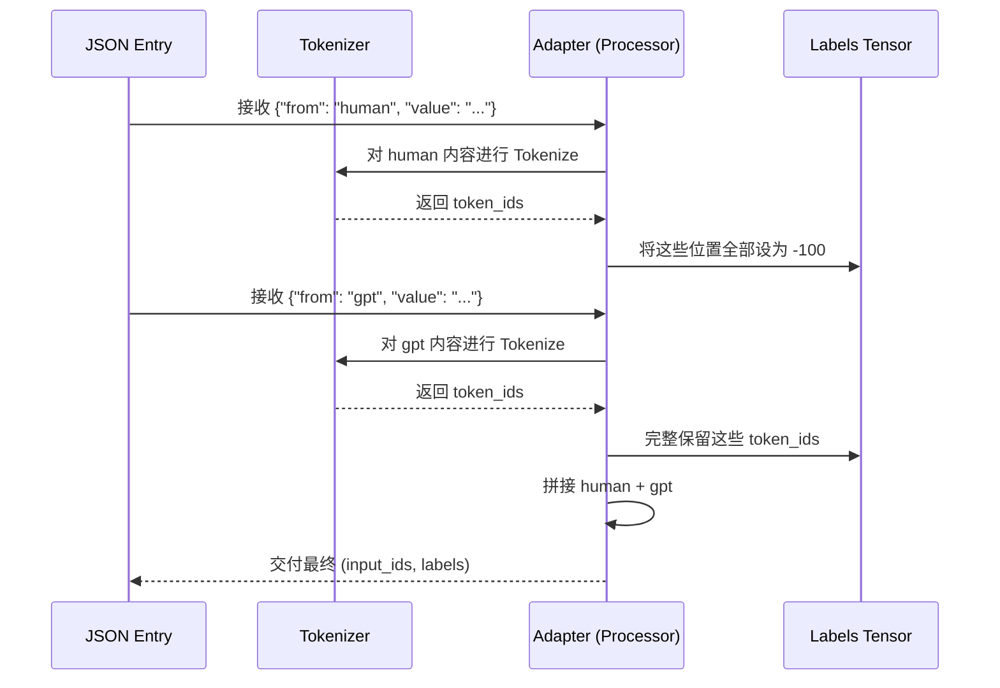
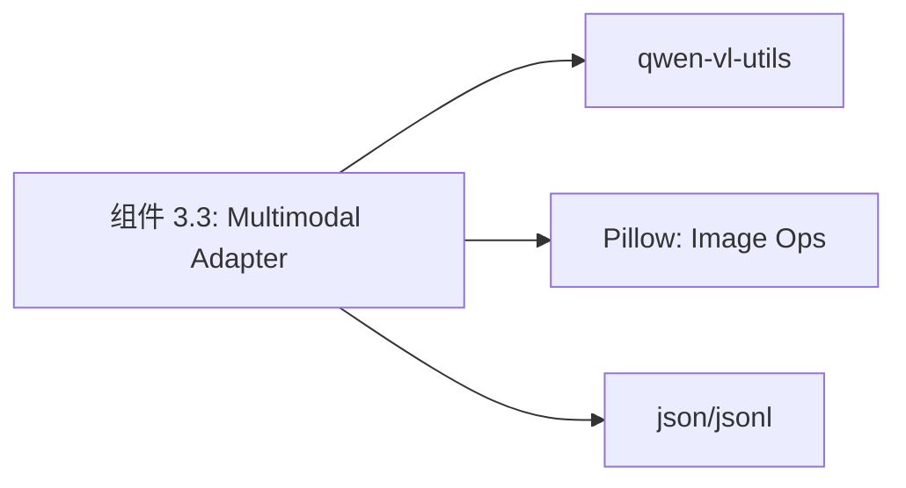

# 组件深度解析：多模态数据适配器 (Multimodal Data Processor)

## 1. 组件概述

在 Qwen-VL 训练流水线中，`Multimodal Data Processor` 是连接“人类语言描述”与“机器张量运算”的关键翻译官。其核心职责是：解析 JSON 格式的指令微调数据，加载并标准化图像/视频资产，将文本转换为 Token ID 序列，并精准计算视觉 Token 在序列中的占位分布。

该组件不仅要保证数据的物理加载（I/O），更要执行复杂的“语义掩码”逻辑，确保模型在微调时只学习 `gpt` 角色的回复，而忽略 `human` 角色的 Prompt。

### 核心价值
- **指令对齐基石**：实现了 `user-assistant` 轮次的物理隔离与 Labels 屏蔽。
- **视觉特征锚点**：在文本序列中自动埋下 `<image>` 和 `<video>` 锚点，为模型层的物理 Token 替换（组件 4）打好基础。

## 2. 架构位置图



## 3. 核心特性表格

| 特性 | 描述 | 技术实现 |
| :--- | :--- | :--- |
| **角色掩码 (Label Masking)** | 自动将 Prompt 区域的 Labels 设为 -100。 | `ChatTemplate` 状态机。 |
| **多级视觉加载** | 支持按帧采样视频或加载单张全清图像。 | 整合 `qwen-vl-utils`。 |
| **混合数据集采样** | 支持对多个不同来源的数据集进行按比例混合。 | `data_list` 注册机制。 |
| **动态长度追踪** | 实时反馈样本消耗的物理 Token 数。 | `count_multimodal_tokens`。 |

## 4. 文件与职责说明 [📄](file://qwen-vl-finetune/qwenvl/data/data_processor.py)

- **`data_processor.py`**:
    - `QwenVLDataset`: 核心类，封装了文件 IO 与单样本转化。
    - `LazySupervisedDataset`: 优化内存占用的延迟加载实现。
- **`data/__init__.py`**:
    - 数据集注册表，定义了本地路径与标注文件的映射关系。

## 5. 核心算法流程：从 JSON 到 Labels



## 6. 公开接口详解

### `QwenVLDataset.__getitem__` [📄](file://qwen-vl-finetune/qwenvl/data/data_processor.py#L80)
加载并处理单个训练样本。

- **逻辑精要**：
    1. 提取样本中的 `image` 或 `video` 列表。
    2. 将 `conversations` 中的对话拼接为 `im_start` / `im_end` 格式。
    3. 调用 `processor` 将视觉资产转为 `pixel_values`。
- **参数**: `index` (样本索引)。
- **返回值**: 包含 `input_ids`, `labels`, `pixel_values`, `grid_thw` 的字典。

## 7. 类型定义：标注格式规范

| 字段 | 类型 | 说明 |
| :--- | :--- | :--- |
| `image` | `Union[str, List]` | 图片的相对或绝对路径。 |
| `conversations` | `List[Dict]` | 必须包含 `from` (human/gpt) 和 `value`。 |
| `value` 中的标签 | `str` | 必须显式包含 `<image>` 或 `<video>` 字符。 |

## 8. 快速开始 (数据集注册)

在 `qwenvl/data/__init__.py` 中添加：
```python
MY_DATA = {
    "annotation_path": "/data/train.json",
    "data_path": "/data/images/",
}
# 训练脚本中即可使用 --dataset_use MY_DATA%100
```

## 9. 常见用例

### 用例 1：Grounding (检测) 数据适配
- **标注内容**：`value: "Locate the dog. <image>"` / `gpt_value: "{"bbox_2d": [100, 200, 300, 400]}"`
- **适配逻辑**：组件会自动识别 JSON 格式的坐标字符串，并将其映射为文本 Token。

### 用例 2：多图多轮对话
场景：用户发了 3 张图并提了 2 个问题。
- **组件行为**：确保 3 组视觉特征按顺序存储，并在 input_ids 的对应位置插入三个视觉占位符。

## 10. 最佳实践

- **路径校验**：建议在微调前运行 `tools/check_image.py`，因为单张图片的丢失会导致整个分布式训练进程挂起。
- **角色映射**：如果您的数据源使用 `user/assistant` 标签，请在 `data_processor.py` 中增加映射别名，确保 Label Mask 正确应用。

## 11. 设计决策：为何使用 -100 作为 Mask 值？

- **底层原因**：PyTorch 的 `nn.CrossEntropyLoss` 默认将 `ignore_index` 设为 -100。
- **收益**：在计算梯度时，Prompt 区域的概率分布不会产生任何 Loss 值，迫使模型将注意力全部集中在如何生成高质量的回答上。

## 12. 内部实现原理：视觉标签转占位符 [📄](file://qwen-vl-finetune/qwenvl/data/data_processor.py#L150)

```python
# 核心转换伪代码
def process_text(text):
    # 将人类可读的 <image> 替换为模型内码 <|vision_start|><|image_pad|><|vision_end|>
    # 注意：<|image_pad|> 的数量必须与 grid_thw 算出的 patch 数严格相等
    ...
```
这一步是适配器最“危险”的操作。如果 `image_pad` 的数量算错，模型的前向传播会因 shape 不匹配而崩溃。适配器通过读取 PIL 图像尺寸并模拟 32 倍降采样逻辑来预判数量。

## 13. 错误处理

- **ValueError: '<image>' tag missing**：JSON 中声明了图片，但对话中没说在哪里看图。
- **Label Leakage**：模型开始复读用户的提问。排查：角色标签是否拼写错误（如 `human` 写成了 `Human`）。

## 14. 依赖关系图



## 15. 相关文档链接

- [模块总览：微调框架总览](./finetune_module_overview.md)
- [组件 3.2：序列打包引擎](./组件_序列打包.md)

## 16. 变更历史

- **v3.0**: 支持多视频（Multi-video）在同一对话流中的适配与掩码计算。

---
*由 [Mini-Wiki v3.0.6](https://github.com/trsoliu/mini-wiki) 自动生成 | 2026-03-01*
