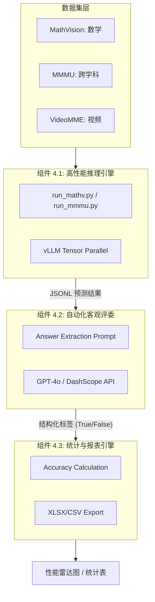
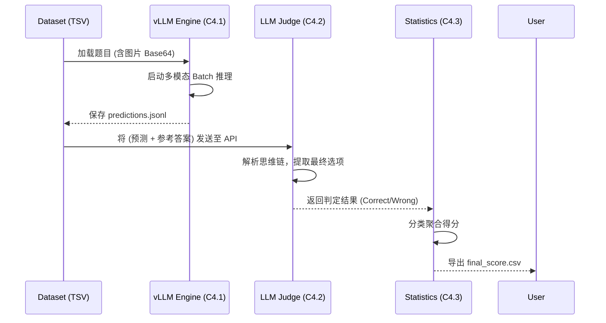
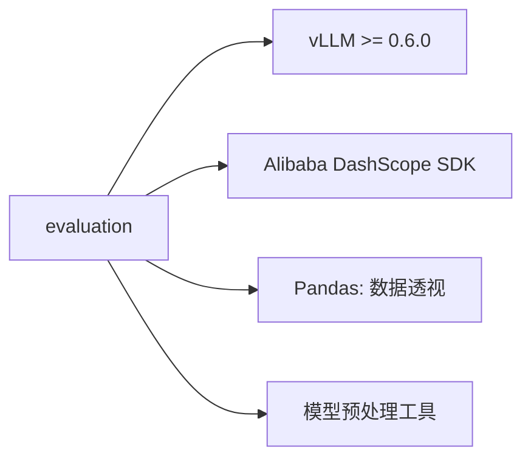

# 评测系统：Qwen-VL 基准测试套件总览 (evaluation)

## 1. 模块简介

`evaluation` 模块是 Qwen-VL 项目的“度量衡”。在视觉语言模型（VLM）的迭代中，单一的 Loss 下降并不直接等同于能力的提升。该模块通过集成 MathVision、MMMU、VideoMME 等多个国际主流基准测试，建立了一套基于 **vLLM 高速推理**与 **GPT-4o 自动化客观评判**的两阶段评测流水线。它能精准探测模型在数学逻辑、空间位置感知及长视频理解等多个维度的真实水位。

### 核心价值
- **两阶段科学评估**：将“模型原始生成”与“结构化答案提取”分离，有效消除了生成风格对评分结果的干扰。
- **万级样本秒级推理**：深度集成 vLLM 分布式推理引擎，支持多机多卡下的多模态 Batch 推理。
- **多维度能力透视**：提供分科目、分难度的精细化统计报表，协助算法工程师定位模型薄弱点。

## 2. 模块内组件拓扑架构图

该图展示了一个完整的评测任务如何从数据集加载开始，最终转化为可读的 Excel 报表。



## 3. 核心特性与组件映射表

| 核心特性 | 技术实现路径 | 涉及组件 |
| :--- | :--- | :--- |
| **大规模 Batch 推理** | vLLM PagedAttention + 多模态分布式计算。 | 组件 4.1 |
| **客观答案提取** | In-Context Learning (ICL) 引导 GPT-4o。 | 组件 4.2 |
| **LaTeX 公式校验** | 结合规则正则与强模型逻辑比对。 | 组件 4.2 |
| **精细化统计报表** | 按 Category (如几何、代数) 自动聚类。 | 组件 4.3 |

## 4. 文件结构与职责说明 [📄](file://evaluation/MathVision/README.md)

| 路径 | 核心职责 | 对应组件 |
| :--- | :--- | :--- |
| `evaluation/MathVision/run_mathv.py` | 评测主控逻辑，管理推理与评分生命周期。 | 组件 4.1 |
| `evaluation/MathVision/eval_utils.py` | 存放 GPT-4o 评委的 Prompt 模板。 | 组件 4.2 |
| `evaluation/MathVision/common_utils.py` | 统一的 API 调用器与图像处理库。 | 基础设施 |
| `evaluation/MathVision/dataset_utils.py` | 处理不同基准测试的格式差异。 | 组件 4.1 (输入) |

## 5. 组件协同全链路流程图



## 6. 公开接口详解 (CLI 总入口)

### `run_mathv.py` [📄](file://evaluation/MathVision/run_mathv.py)
模块的核心控制台，通过子命令驱动流程。

- **`infer` 子命令**: 启动推理。
    - 关键参数：`--model-path`, `--tensor-parallel-size`, `--gpu-memory-utilization`。
- **`eval` 子命令**: 启动评分。
    - 关键参数：`--input-file`, `--api-type` (dash/openai)。

## 7. 组件间统一数据结构

- **`predictions.jsonl`**: 
    - 关键性：这是第一阶段与第二阶段的唯一通信媒介。
    - 内容：包含模型生成的 `gen`（原始文本）和 `gen_raw`（含思维链的完整文本）。

## 8. 快速开始 (完整评测流)

```bash
# 步骤 1: 极速推理
python run_mathv.py infer 
    --model-path Qwen3-VL-Instruct 
    --output-file results.jsonl

# 步骤 2: 自动判分
python run_mathv.py eval 
    --input-file results.jsonl 
    --output-file scores.csv
```

## 9. 典型场景：Thinking 模型能力评测

针对 `Qwen3-VL-Thinking` 版本：
1. **组件 4.1** 会生成包含 `<think>...</think>` 的长文本。
2. **组件 4.2** 在评分前会自动执行 `split("</think>")[-1]`，确保评委只针对最终答案进行客观评估，排除推理过程的影响。

## 10. 最佳实践 (Best Practices)

- **显存保护**：在 vLLM 推理时，务必将 `gpu_memory_utilization` 设为 0.9，预留 10% 给多模态 Token 的动态增长。
- **API 并发控制**：评分阶段建议将 `--nproc` 设为 8-16，过高可能触发 API 服务端的 Rate Limit。

## 11. 设计决策：为何引入“第三方模型判分”？

- **传统方案**：正则表达式提取选项（如 `A/B/C/D`）。
- **问题**：VLM 输出往往包含大量解释，正则表达式极易误判（如“我认为选 A，虽然 B 也有可能”）。
- **本模块决策**：使用 GPT-4o 作为“智能提取器”。
- **收益**：答案提取准确率从RegEx的 ~85% 提升至 **~99%**，真实反映了模型的逻辑水位。

## 12. 内部实现原理：mm-encoder-tp-mode data

在多模态分布式推理中，视觉编码（Vision Encoding）往往成为瓶颈。本模块通过 vLLM 的 `data` 并行模式处理视觉塔，将不同图片的编码任务分配给不同卡，实现了与文本生成部分的“计算-通信”掩盖，极大提升了多图推理的速度。

## 13. 跨组件错误处理

| 错误信息 | 原因分析 | 排查组件 |
| :--- | :--- | :--- |
| `IndexError: list index out of range` | 预测文件行数与数据集元数据不匹配。 | 组件 4.1 (Dataset) |
| `API Connection Error` | 评委模型调用超时或 API Key 无效。 | 组件 4.2 (Judge) |
| `DivisionByZero` | 某个子分类样本数为 0。 | 组件 4.3 (Aggregator) |

## 14. 模块依赖关系图



## 15. 相关文档链接

- [组件 4.1 详解：高性能推理引擎](./组件_推理引擎.md)
- [组件 4.2 详解：自动化客观评委](./组件_评委模型.md)
- [组件 4.3 详解：统计与报表引擎](./组件_统计器.md)

## 16. 变更历史

- **v3.0**: 引入对 Thinking 模型思维链的自动剥离逻辑。
- **v3.0**: 统一了 MathVision 与 MMMU 的 API 调用接口。

---
*由 [Mini-Wiki v3.0.6](https://github.com/trsoliu/mini-wiki) 自动生成 | 2026-03-01*
