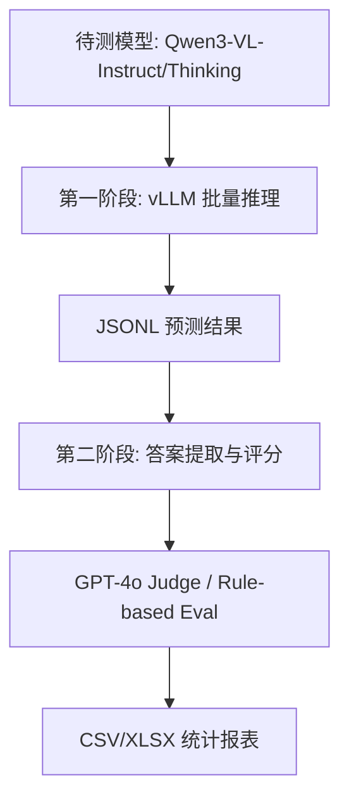
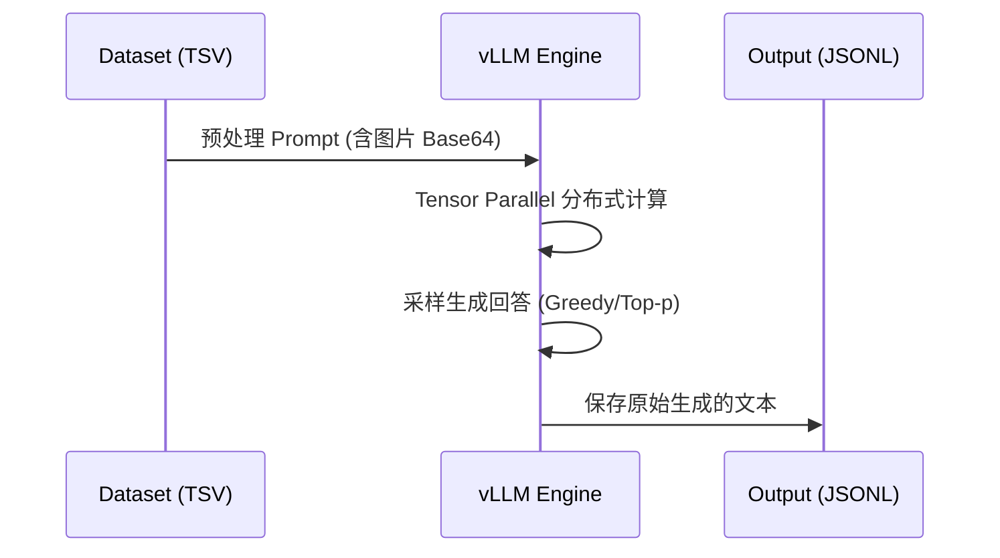
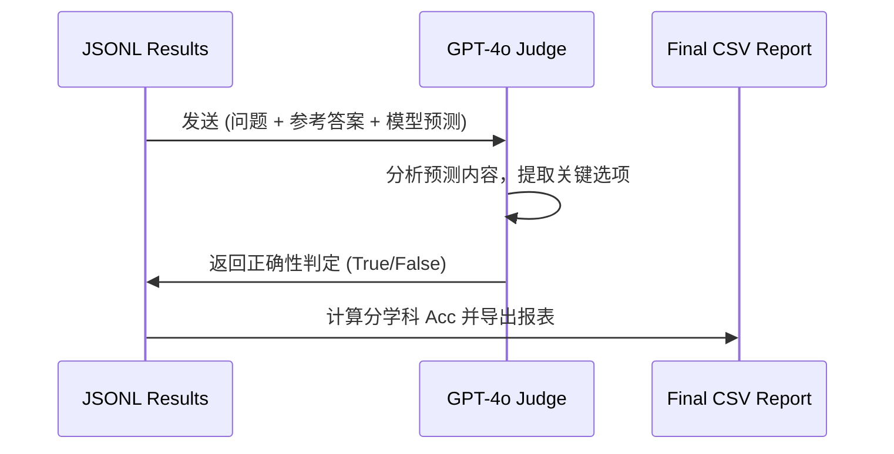

# 评测系统：Qwen-VL 基准测试套件 (evaluation)

## 1. 模块概述

`evaluation` 模块是 Qwen-VL 项目中用于衡量模型多模态能力的核心组件。它集成了一系列国际主流的视觉语言基准测试（Benchmarks），通过统一的推理引擎（vLLM）和自动化的评委评分机制，实现了对模型在数学推理、常识问答、长视频分析及空间定位等多维度能力的客观评估。

### 1.1 核心价值
- **高性能评测**: 利用 vLLM 的 `tensor-parallel` 和 `automatic batching` 技术，将万级样本的评测时间从天级缩短至小时级。
- **两阶段科学评估**: 区分模型原始输出与结构化答案提取，引入 GPT-4o 作为公正评委，确保评分的准确性与鲁棒性。
- **全场景覆盖**: 涵盖从静态图像理解（MMMU）到动态时空逻辑（VideoMME）的全模态能力测评。

### 1.2 架构位置



## 2. 支持的基准测试矩阵

| 基准名称 | 核心评估维度 | 样本规模 | 评测方式 |
| :--- | :--- | :--- | :--- |
| **MathVision** | 视觉数学推理、几何逻辑、LaTeX 公式。 | ~3,000 | GPT-4o 辅助评分。 |
| **MMMU** | 跨学科多模态理解（大学水平知识）。 | ~11,500 | 多选题客观评分。 |
| **VideoMME** | 长短视频内容分析、时序动作定位。 | ~900 视频 | 多选题 + 时间戳校验。 |
| **RealWorldQA** | 真实世界场景感知（驾驶、导航、安全）。 | ~700 | 多选题客观评分。 |
| **ODinW-13** | 目标检测 (Grounding) 与边界框预测。 | 13 个任务 | mAP 精度计算。 |

## 3. 目录结构与职责 [📄](file://evaluation/MathVision/README.md)

| 路径 | 职责 | 备注 |
| :--- | :--- | :--- |
| `MathVision/` | 视觉数学专项评测。 | 包含 `run_mathv.py` 核心逻辑。 |
| `mmmu/` | 跨学科综合能力评测。 | 包含针对大学课业难度的 prompt。 |
| `VideoMME/` | 视频理解能力专项评测。 | 支持长视频切片推理。 |
| `RealWorldQA/` | 真实世界场景测评。 | 侧重于空间感知与安全。 |
| `common_utils.py` | 通用的图像处理与 API 调用工具。 | [📄](file://evaluation/MathVision/common_utils.py) |
| `eval_utils.py` | 统一的评分算子与 Prompt 模板。 | - |

## 4. 核心工作流：两阶段流水线 [📄](file://evaluation/MathVision/run_mathv.py#L201)

### 阶段一：vLLM 高效推理
vLLM 通过其独特的 PagedAttention 和动态 Batch 策略，能够充分榨取 GPU 算力。



### 阶段二：自动化评分与提取
通过 GPT-4o 等强模型，将模型生成的非结构化文本转化为分类得分。



## 5. 推理引擎配置 (vLLM) [📄](file://evaluation/MathVision/run_mathv.py#L400)

为了保证评测的公平性与高性能，推荐以下配置：

| 配置项 | 推荐值 | 说明 |
| :--- | :--- | :--- |
| `tensor_parallel_size` | GPU 数量 | 建议单卡 2B，8 卡 32B/72B。 |
| `gpu_memory_utilization` | `0.9` | 预留 10% 显存处理 KV Cache。 |
| `max_model_len` | `128000` | 确保长视频 Token 不被截断。 |
| `mm_encoder_tp_mode` | `data` | **关键**：加速多模态编码的 TP 模式。 |

---

## 6. 公共 API 详细参考

### 6.1 `run_mathv.py` 命令行接口

#### `infer` 子命令
```bash
python run_mathv.py infer 
    --model-path /path/to/model 
    --dataset MathVision 
    --output-file results.jsonl 
    --max-new-tokens 32768
```

#### `eval` 子命令
```bash
python run_mathv.py eval 
    --input-file results.jsonl 
    --output-file scores.csv 
    --api-type dash # 阿里云 API 模式
```

---
*(待续：下一部分将包含评测参数表、代码示例、性能优化、错误处理及源码追溯等章节)*
