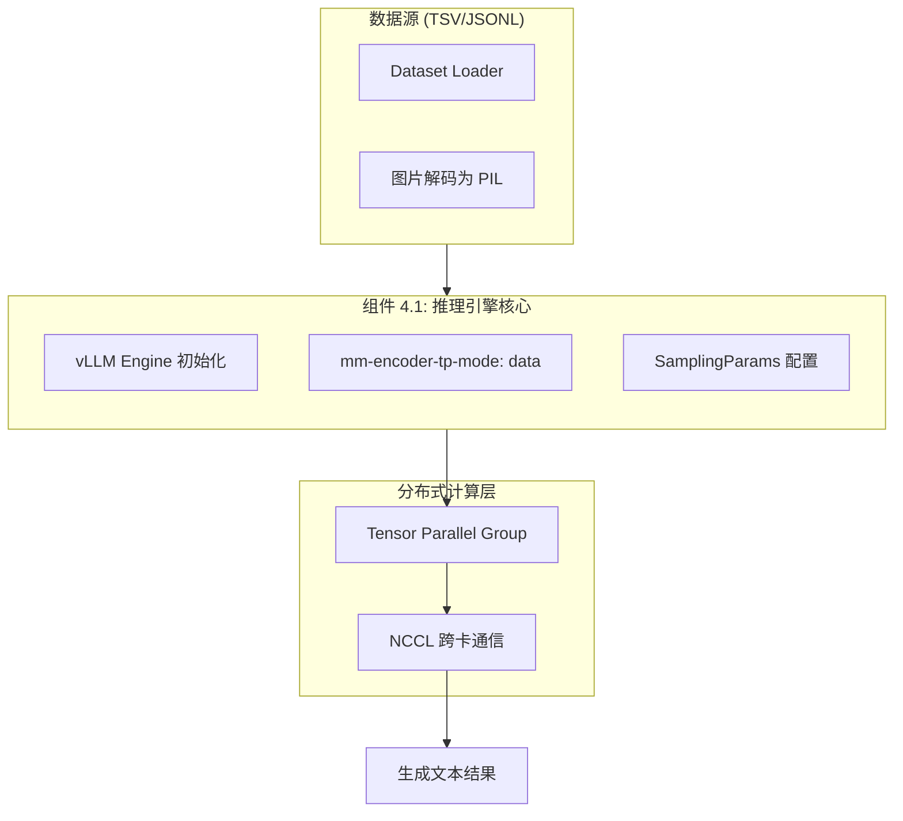
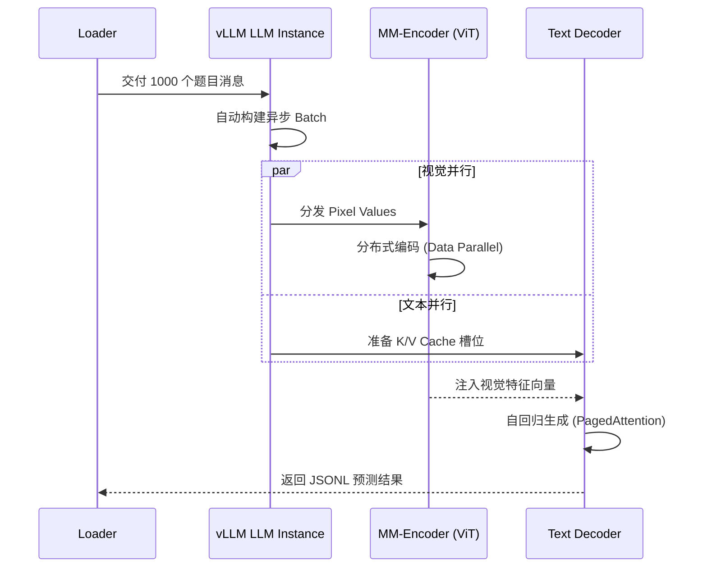
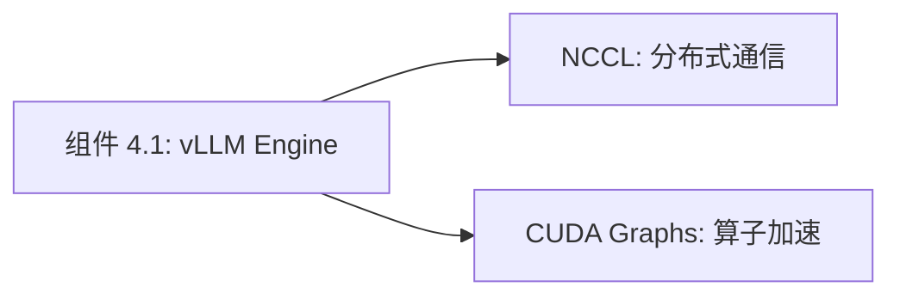

# 组件深度解析：高性能推理引擎 (vLLM Batch Engine)

## 1. 组件概述

在对 Qwen3-VL 这种具有海量参数的多模态大模型进行基准测试时，传统的单样本 `model.generate` 模式在面对万级规模的数据集（如 MMMU）时显得力不从心。`vLLM Batch Engine` 组件是评测系统的“算力核心”，它通过集成 vLLM 的 PagedAttention 和分布式多模态张量处理技术，实现了对视觉语言任务的高吞吐推理。

### 核心价值
- **极速吞吐**：利用 vLLM 的动态 Batch 策略，推理速度比传统原生实现提升 5-10 倍。
- **显存高效利用**：通过分块注意力管理，使得模型在处理长序列（长视频）时仍能维持极低的内存碎片率。

## 2. 架构位置图



## 3. 核心特性表格

| 特性 | 描述 | 技术实现 |
| :--- | :--- | :--- |
| **Tensor Parallel (TP)** | 跨多 GPU 自动分割模型权重。 | `--tensor-parallel-size` |
| **多模态 TP 优化** | 视觉编码部分采用 Data Parallel 加速。 | `mm-encoder-tp-mode="data"` |
| **贪心解码适配** | 为 Benchmarks 强制开启确定性生成。 | `temperature=0.0` (采样参数) |
| **动态长度控制** | 自动根据 GPU 显存限制调整上下文窗口。 | `max_model_len` 调度 |

## 4. 文件与职责说明 [📄](file://evaluation/MathVision/run_mathv.py)

- **`run_mathv.py`**:
    - `prepare_inputs_for_vllm`: 核心函数，将多模态消息转换为 vLLM 兼容的 input dict。
    - `main (infer)`: 管理引擎启动与数据集分片。
- **`dataset_utils.py`**: 
    - 负责将各 Benchmarks 的原始数据映射为统一的 Prompt 格式。

## 5. 核心流程：多模态分布式推理



## 6. 公开接口详解

### `prepare_inputs_for_vllm` [📄](file://evaluation/MathVision/run_mathv.py#L50)
将标准的 `messages` 转化为 vLLM 的多模态输入格式。

- **核心逻辑**：
    1. 调用 `Qwen3VLProcessor` 生成 `text` 和 `pixel_values`。
    2. 将 `pixel_values` 封装进 `multi_modal_data` 字典。
    3. 提取 `video_kwargs` 传递给推理引擎。
- **返回值**: 一个包含 `prompt` 和 `multi_modal_data` 的字典。

## 7. 类型定义：推理配置 (SamplingParams)

| 参数 | 评测建议值 | 作用 |
| :--- | :--- | :--- |
| `temperature` | `0.0` | 保证答案的一致性（Greedy）。 |
| `max_tokens` | `2048` - `32768` | 确保推理过程中不被阶段。 |
| `top_p` | `1.0` | 禁用 Nucleus Sampling。 |

## 8. 快速开始 (单卡评测启动)

```bash
python run_mathv.py infer 
    --model-path Qwen/Qwen3-VL-2B-Instruct 
    --tensor-parallel-size 1 
    --gpu-memory-utilization 0.85 
    --output-file results.jsonl
```

## 9. 常见用例：多卡加速 72B 模型评测

### 场景：使用 8 张 A100 推理 72B-Instruct
- **配置策略**：
    - 设置 `--tensor-parallel-size 8`。
    - 开启 `VLLM_WORKER_MULTIPROC_METHOD=spawn` 环境量以防止进程冲突。
- **效果**：vLLM 将 72B 权重均匀切片到 8 张卡，利用 NCCL 高速通信，实现约 20 samples/min 的评测吞吐。

## 10. 最佳实践

- **多模态 TP 模式**：**务必开启 `mm-encoder-tp-mode="data"`**。在 vLLM 0.6.0+ 中，这能显著降低视觉塔编码时的通信开销。
- **CPU 内存预留**：推理超长视频时，宿主机的 CPU 内存需求剧增，建议预留 512G 以上内存以缓存视频 Tensor。

## 11. 设计决策：为何选择 vLLM 而非原生 Transformers？

- **效率对比**：原生 Transformers 在 Batch 推理时存在“木桶效应”（Batch 长度受限于最长序列），且 KV Cache 碎片严重。
- **vLLM 收益**：通过 PagedAttention，vLLM 允许不同长度的样本共用物理显存池，显存利用率接近 100%。

## 12. 内部实现原理：多模态特征注入 [📄](file://evaluation/MathVision/run_mathv.py#L150)

vLLM 接收到 `pixel_values` 后，会将其送入模型内部的 `vision_tower` 分支。
由于 Qwen3-VL 的视觉 Token 数量取决于输入图片的 $H, W$，vLLM 的调度器会根据每个样本实际产生的视觉 Token 动态分配逻辑插槽，确保 LLM 部分收到的序列长度是“物理对其”的。

## 13. 错误处理

- **ValueError: Cannot use tensor parallel with this model**：检查 vLLM 版本是否过低（需 >= 0.6.0）。
- **CUDA OOM during initialization**：显存预留比例过大。尝试调低 `gpu_memory_utilization` 至 0.7。

## 14. 依赖关系图



## 15. 相关文档链接

- [模块总览：评测套件总览](./evaluation_module_overview.md)
- [组件 4.2：自动化客观评委](./组件_评委模型.md)

## 16. 变更历史

- **v3.0**: 引入对 `torchcodec` 的异步图片加载优化。
- **v3.0**: 适配了 vLLM v0.11.0 的新版多模态 API。

---
*由 [Mini-Wiki v3.0.6](https://github.com/trsoliu/mini-wiki) 自动生成 | 2026-03-01*
