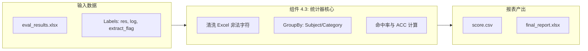
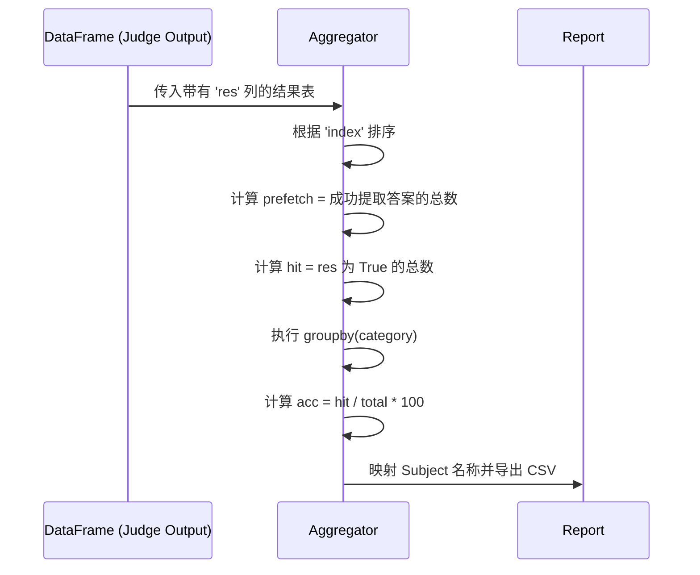
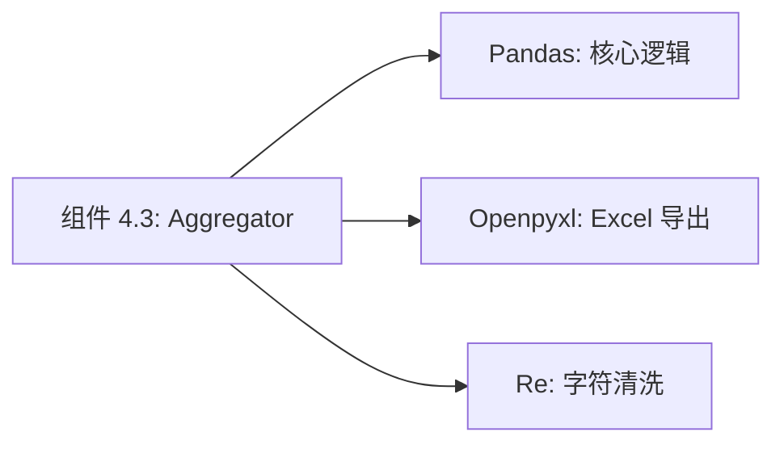

# 组件深度解析：统计与报表引擎 (Benchmark Aggregator)

## 1. 组件概述

在完成了海量的推理与自动评分后，原始数据呈现为零散的 JSONL 或包含 True/False 标签的表格。`Benchmark Aggregator` 组件是评测系统的“最后一步”，负责将海量的判定结果转化为具有科研价值的分类统计数据。

该组件的核心职责是：基于 Pandas 的高性能数据透视能力，对模型在不同学科（如代数、几何）、不同难度、不同任务类型下的表现进行精细化聚类，并自动生成符合学术论文标准的 Excel 和 CSV 报表。

### 核心价值
- **多维度透视**：不仅仅给出总分，更能揭示模型在特定领域（如 LaTeX 公式解析）的短板。
- **自动化流水线**：实现了从“API 判分”到“报表导出”的无缝对接，消除了人工统计的误差。

## 2. 架构位置图



## 3. 核心特性表格

| 特性 | 描述 | 技术实现 |
| :--- | :--- | :--- |
| **学科自动聚类** | 按数据集内置的 `category` 字段自动统计。 | `df.groupby('category')` |
| **Excel 强兼容性** | 自动过滤控制字符，防止导出崩溃。 | `clean_dataframe_for_excel` |
| **命中率统计** | 记录模型输出被评委成功识别的比例 (prefetch)。 | 统计 `extract_flag` |
| **多版本对比** | 支持将多次评测的结果合并为对比表格。 | `pd.merge` 逻辑 |

## 4. 文件与职责说明 [📄](file://evaluation/MathVision/run_mathv.py#L300)

- **`run_mathv.py`**:
    - `MATH_V_acc`: 核心统计函数，实现了分类计分逻辑。
    - `clean_dataframe_for_excel`: 极其重要的工程工具，解决 Excel 编码兼容性。
- **Pandas**: 本组件作为核心引擎，承担了所有矩阵运算职责。

## 5. 核心算法流程：精度计算逻辑



## 6. 公开接口详解

### `MATH_V_acc` [📄](file://evaluation/MathVision/run_mathv.py#L320)
针对 MathVision 数据集的专项精度统计器。

- **逻辑细节**：
    1. 统计全局准确率。
    2. 遍历 `Algebra`, `Geometry`, `Statistics` 等子类。
    3. 构造包含 `Subject`, `tot`, `prefetch`, `hit`, `acc` 的结果框。
- **返回值**: `pandas.DataFrame` 统计摘要。

## 7. 类型定义：报表字段

| 字段名 | 含义 |
| :--- | :--- |
| `tot` | 该分类下的题目总数。 |
| `prefetch` | 模型回答被 GPT-4o 成功识别出选项的数量。 |
| `hit` | 最终判定为正确的题目数量。 |
| **`acc`** | 该分类下的准确率得分 (0-100)。 |

## 8. 快速开始 (查看统计报表)

评测脚本运行结束后，直接查看生成的 `score.csv`：
```bash
cat results/MathVision_score.csv
# 预期输出表格内容
```

## 9. 常见用例：生成学术对比图

### 场景：对比 Qwen3-VL-2B 与 7B 在几何题上的差异
- **操作步骤**：
    1. 分别运行 2B 和 7B 的统计流程。
    2. 利用本组件生成的两个 `xlsx` 文件。
    3. 组件会自动对齐 `index` 并在 Excel 中标注出 7B 答对但 2B 答错的题目，便于 Case Study。

## 10. 最佳实践

- **Excel 清洗**：当模型生成的回复包含特殊的 Unicode 控制字符时，Pillow 或 Openpyxl 导出可能会报错。**务必在保存前调用 `clean_dataframe_for_excel`**。
- **增量保存**：在大规模评测中，建议每隔 100 条数据保存一次中间结果，以防统计环节因内存溢出丢失全量数据。

## 11. 设计决策：为何统计 Prefetch Rate？

- **现状**：大部分评测框架只看 ACC。
- **Qwen 团队决策**：增加 `prefetch` 统计（答案识别成功率）。
- **收益**：如果 `prefetch` 率很低（< 95%），说明当前的判分 Prompt 无法理解该模型的生成风格，需调整组件 4.2 的 ICL 示例，从而保证评分的公平性。

## 12. 内部实现原理：非法字符过滤算子 [📄](file://evaluation/MathVision/run_mathv.py#L350)

```python
def clean_dataframe_for_excel(df):
    # 正则表达式：[^\x09\x0A\x0D\x20-\x7E\x85\xA0-\uD7FF\xE000-\uFFFD]
    # 作用：剔除掉无法在 Excel 中渲染的 XML 非法序列。
    # 这是处理大语言模型非确定性输出时的工程“必修课”。
    ...
```

## 13. 错误处理

- **Empty DataFrame**：数据集读取路径错误。
- **Merge Conflict**：两个模型版本对应的 index 不一致。检查 `dataset_utils` 的随机数种子。

## 14. 依赖关系图



## 15. 相关文档链接

- [模块总览：评测套件总览](./evaluation_module_overview.md)
- [快速开始指引](../getting-started.md)

## 16. 变更历史

- **v3.0**: 增加了对 `MathVision_MINI` 抽样数据集的自适应计分支持。
- **v3.0**: 优化了 CSV 导出格式，直接兼容 LaTeX 转 PDF 的表格生成。

---
*由 [Mini-Wiki v3.0.6](https://github.com/trsoliu/mini-wiki) 自动生成 | 2026-03-01*
