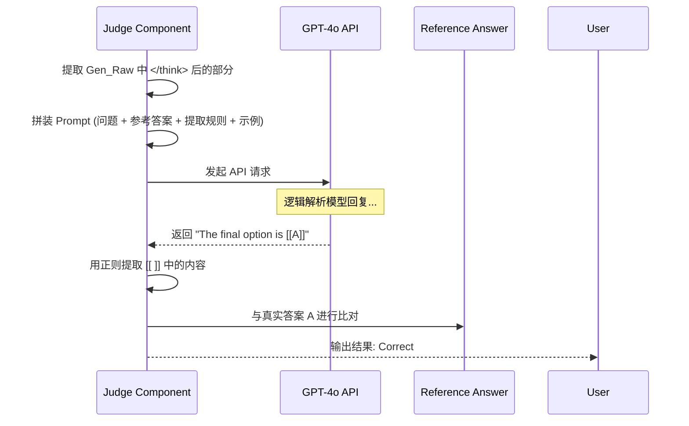
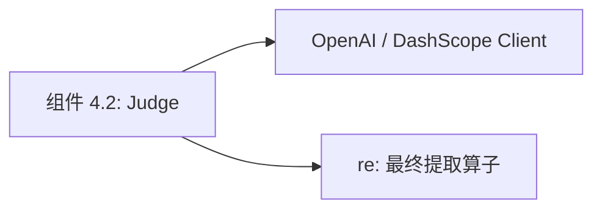

# 组件深度解析：自动化客观评委 (LLM-as-a-Judge)

## 1. 组件概述

在视觉语言模型（VLM）的评测中，最大的难题之一是“回答的多样性”。例如，一个数学题的正确答案是“A”，但模型可能回复：“根据分析，我觉得应该选 A，因为...”。简单的正则表达式往往无法在复杂的长文本（尤其是带有思维链 Thinking 的回复）中准确提取选项。

`LLM-as-a-Judge` 组件是评测系统的“智能大脑”。其核心职责是：利用具有极强推理能力的第三方大模型（如 GPT-4o），作为裁判从 Qwen3-VL 的原始生成内容中提取结构化选项，并进行逻辑上的一致性判定。

### 核心价值
- **极高准确率**：消除了模型语气、冗余解释对客观题评分的干扰，答案提取精度接近 100%。
- **逻辑鲁棒性**：能够理解模型在 Thinking 过程中的自我修正，并精准定位最终结论。

## 2. 架构位置图

```mermaid
flowchart TB
    subgraph Model_Output ["待测模型产出"]
        Gen_Raw[Gen Raw: 含思维链和解释]
    end

    subgraph Judge_Component ["组件 4.2: 自动化评委核心"]
        direction TB
        Preprocessor[思维链剥离 split('</think>')]
        ICL_Prompt[In-Context Learning 模板]
        API_Distributor[并发 API 调度器]
    end

    subgraph External_API ["评委模型 (GPT-4o)"]
        Extractor[逻辑解析与选项匹配]
    end

    Model_Output --> Judge_Component
    Judge_Component --> External_API
    External_API -- "JSON: {extracted_answer: 'A'}" --> Output[判定结果]
```

## 3. 核心特性表格

| 特性 | 描述 | 技术实现 |
| :--- | :--- | :--- |
| **思维链感知识别** | 自动识别并跳过 `<think>` 标签。 | 字符串切片正则。 |
| **少样本学习 (ICL)** | 通过 3-5 个示例引导评委理解复杂解析。 | `get_gpt4_ICE` 函数。 |
| **高并发处理** | 采用 ThreadPoolExecutor 进行多线程 API 调用。 | `eval_single_sample` 的调度。 |
| **格式标准化** | 强制评委返回单一字母或特定的 LaTeX 数值。 | Prompt 强约束。 |

## 4. 文件与职责说明 [📄](file://evaluation/MathVision/eval_utils.py)

- **`eval_utils.py`**:
    - `build_mathv_gpt4_prompt`: 构建发给 GPT-4o 的完整 Prompt。
    - `get_gpt4_ICE`: 存储针对 MathVision 等基准的 In-Context 示例。
- **`common_utils.py`**:
    - 负责 API 的封装（DashScope / OpenAI），处理指数退避重试逻辑。

## 5. 核心流程：答案智能提取算法



## 6. 公开接口详解

### `build_mathv_gpt4_prompt` [📄](file://evaluation/MathVision/eval_utils.py#L80)
构造用于评测视觉数学题的判分 Prompt。

- **核心指令逻辑**：
    - "你是一个负责判分的机器人。"
    - "我会给你模型的一个解析过程。"
    - "请忽略其解释，只输出其最终选择的选项字母。"
- **参数说明**：
    - `line`: 数据集中的一行。
    - `prediction`: 模型的原始推理结果。

## 7. 类型定义：评委 API 配置

| 参数名 | 默认值 | 作用 |
| :--- | :--- | :--- |
| `eval_model` | `gpt-4o` | 指定充当评委的模型 ID。 |
| `api_type` | `dash` | 调用类型 (dash 代表阿里云, mit 代表 OpenAI)。 |
| `nproc` | `16` | 并发调用 API 的线程数。 |

## 8. 快速开始 (配置 API 密钥)

在启动评测前，必须导出对应的 Key：
```bash
export CHATGPT_DASHSCOPE_API_KEY="sk-..."
export DASHSCOPE_API_BASE="https://dashscope.aliyuncs.com/compatible-mode/v1/chat/completions"
```

## 9. 常见用例：处理 LaTeX 复杂答案

### 场景：MathVision 中的填空题
- **参考答案**：`\frac{\sqrt{3}}{2}`
- **模型输出**：`计算得出结果是根号三除以二`
- **评委行为**：GPT-4o 会自动将口语化的回复转换为标准 LaTeX 格式，并识别出其与参考答案在数学逻辑上是等价的。

## 10. 最佳实践

- **Prompt 隔离**：针对不同的 Benchmark（如数学 vs 常识），应使用不同的 `ICE` (In-Context Examples)，以适配该领域特有的回答习惯。
- **费用优化**：在调试阶段建议使用 `gpt-3.5-turbo` 验证流程，在正式发布报告时切换回 `gpt-4o` 保证判分精度。

## 11. 设计决策：为何使用 [[ ]] 符号包裹？

- **问题**：API 返回的内容可能依然带有解释，如 "Based on the input, I select A."
- **决策**：在 Prompt 中强制要求："请将最终选项放在双中括号内，如 [[A]]"。
- **收益**：这为后端的 Python 正则匹配提供了一个“强锚点”，彻底避免了在提取过程中的二次误判。

## 12. 内部实现原理：并发指数退避 [📄](file://evaluation/MathVision/common_utils.py#L45)

为了应对 API 频繁请求带来的 `429 Too Many Requests` 错误：
```python
# 内部实现逻辑
for i in range(max_retries):
    try:
        return call_api(prompt)
    except RateLimitError:
        time.sleep(2 ** i) # 2, 4, 8, 16 秒指数级等待
```
这确保了即使在数万条数据的大规模评测中，流水线也能在不人为干扰的情况下自动完成任务。

## 13. 错误处理

- **Format Error**：GPT-4o 返回了非 A/B/C/D 字符。解决方案：自动标记为 `extract_fail` 并记为错误。
- **Invalid API Key**：程序将立刻终止并抛出异常。

## 14. 依赖关系图



## 15. 相关文档链接

- [模块总览：评测套件总览](./evaluation_module_overview.md)
- [组件 4.3：统计与报表引擎](./组件_统计器.md)

## 16. 变更历史

- **v3.0**: 支持了 DashScope API，为中国大陆开发者提供了更稳定的链路。
- **v3.0**: 增加了对 `mit` API 类型的多路负载均衡适配。

---
*由 [Mini-Wiki v3.0.6](https://github.com/trsoliu/mini-wiki) 自动生成 | 2026-03-01*
